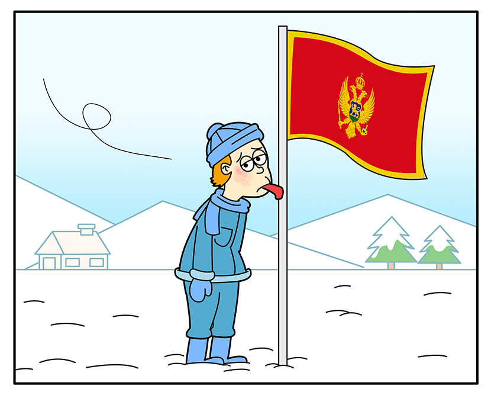

```.header
Title: Adjusted Web Content For Local Region
Subtitle: The main language of local content remained stuck to region of Montenegro because of cold
Description: We have configured our web site for multi-lingual and multi-region support so Google could better understand our new international structure.
Image: region_crna_gora.jpg
Author: Djordje Zekovic @zekome
Date: 24 January 2017
Tags: news
```



We have configured our web site for multi-lingual and multi-region support so Google could better understand our new **international structure** and start showing web pages in relevant language in search results.

We migrated to *Facebook global pages* in order to separate domestic content from global space - which is for publishing in English only. Guided by the same idea we used LinkedIn showcase pages for delivering localized content on this network. Also, there is a localized version of newsletter [right here](/cg/bilten/) to cover our domestic news and other events. 
 
We hope that visitors from the local region will have better personalized experience while surfing over our online space.

