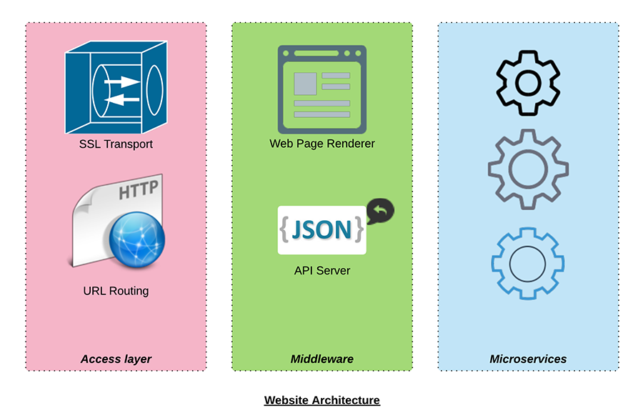
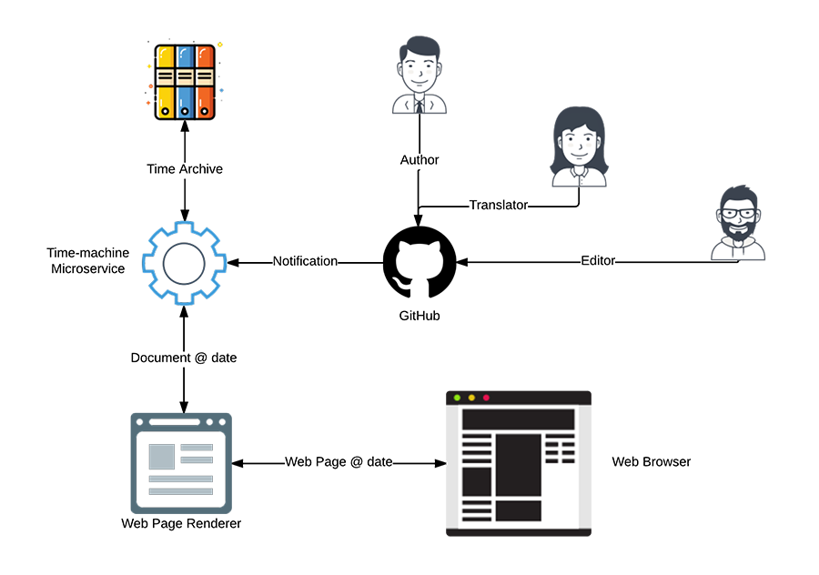

```.header
Title: Get A Time Machine For You Blog
Subtitle: This is not yet another attempt to build a time machine, we actually made it
Description: A microservice responsible for our blog and other public documentation, which enables a time machine for content, including images.
Image: delorean.jpg
Author: Djordje Zekovic @zekome
Date: 22 February 2017
Tags: microservices
```


We have implemented a microservice responsible for our blog and public documentation. The little piece of software enables a time machine for documents. Changes are tracked with Git versioning system. It’s public and transparent way of dealing with modifications, which might be an additional benefit ensuring trusted relationship with your readers.

**Time machine**

It is an interesting feature. A time machine for travelling through different versions of content, including images. The DeLorean machine drives back to the past with a return ticket. The rule is simple. You can’t touch anything, but you can take a look.

When you share a link with your friends on social networks, you certainly don’t want shared content to change. It should remain just like it was at the moment you have shared it. 

**Append @date at the end of link address and time-machine guarantees exactly version from that day.**
 
Authors don’t need anymore to leave update notes at the end of blog entry. Simply, they maintain the latest version of the information. When someone is surfing the history the system will display notification at the top of web page saying that there is a newer version.

A @date appendix can take different formats:

- @20170222 - version on day 02/22/2017
- @201702 - version on Feb the 1st, 2017
- @2017 - version on the first day of year 2017.

## Fly with time-machine

In order to try a time-machine you can go back to history of current article on day [02/22/2017](@20170222). The major difference is that we have added diagrams below and this paragraph later - it doesn’t exist back then.

## The significance of implementation for us

Data is stored on GitHub’s infrastructure. There is no more database in our system. There are just two components - a web server and adjusted structure of information. We expand system with new web servers, while data is loaded into RAM on server boot.

Now, we can with ease bring a new instance of web server within cluster group for a specific time period - until we handle current load and then shut it down after. It costs us just few additional instance/hours. The system before was more expensive. We had to reserve capacity in advance and pay the same price no matter what was the traffic load. Expense goes even higher with high-availability DB deployments. It’s good not to have this kind of expenses anymore.

We can place server instances in different regions across the world without considering DB replication between regions. It means faster response time between users and web server.

An implementation of new content serving engine means savings. It's measured in less dollars per hour and less system administration necessary to maintain a server.

We ask co-workers on project to send us a document in standard Markdown format. And programmers to send us a Pull-request on GitHub. No more burden of CMS administration. Everything is much simpler now.
 
*REMINDER: An architecture of our web site is based on three layers with microservices in the backend. The first layer is responsible for access security and URL based routing. The middleware renders HTML responses based on predefined templates. And microservices layer is just serving the data, while in the backend takes care of all logic necessary to maintain the right structure of information. All layers can be expanded on per need.*



## Functional description

The main functionality of microservice is automatically loading and archiving of all versions of data from specified Git repository and adjusting data structures for easy usage in web application. The archive’s base entity is a *document*, which consists of text, attached images, and other files.

## Collaborative content management 

Document can be crafted through collaboration of more users using Git tool. Editorial process is separate from the software logic. One user can prepare the first version of the document, someone can insert images with illustration, other users can translate it, and at the end, responsible editors can make final changes and publish the document. Everything can roll out in public with GitHub repositories, or in private - for example, over BitBucket repositories. When changes have been committed, the system receives a notification, and then loads commits.



## Markdown for text styling

Text of document can be styled using Markdown language. You can use any Markdown editor for writing. We use GitHub’s built-in Markdown editor, which comes with preview for styled text. Beyond standard GitHub Markdown syntax, we introduced some of our own markdown elements. It’s an element for video injection and document header containing fundamental meta data. We can always upgrade with new markdown elements if needed. A microservice renders Markdown to HTML on the fly. It enables injection of dynamic content in document - like current number of logged-in users, weather forecast, or maybe even an ad. Clients using microservice can provide additional data within calling API context. Provided data can be placed into placeholders defined by Markdown syntax.

## Document basics
A document is uniquely defined with its directory path. A directory path is relative within archive and can be mapped to some part of URL address. Inside directory you can upload images and other related files, which you can link in document using Markdown syntax. The text of document must be saved to “index.md” file in the same directory as other related files. The rules are similar to those general ones that applies to directories and index files on standard web servers. Every change to files represents a new version of a document.

Every document contains a header with meta data. A header section includes: title, subtitle, description, date, authors, oggraph attributes, classification, and other tags. You can create a document draft, or hide it from the public index.

<pre>
```.header
Title: Get A Time Machine For You Blog
Subtitle: This is not yet another attempt to build a time machine, we actually made it
Description: A microservice responsible for our blog and other public documentation, which enables a time machine for content, including images.
Image: delorean.jpg
Author: Djordje Zekovic @zekome
Date: 22 February 2017
Tags: microservices
```
</pre>

## Multi-lingual support

A document has a multi-lingual support. You can use header directives to point to different language versions of document. Language information is later available on every API call for the purpose of creating Google *hreflang* tags for multi-linugal and multi-regional web pages.

By appending a date at the end of URL address, we potentially create a lot of links to the same content, but different versions in time. The question is how will Google and other web crawlers index those versions-in-time of the same web page. We solved it by adding the same canonical link to every version-in-time web page. That way Google will index only the latest version of a web page, no matter how many versions-in-time of the same web page have been shared over the Internet.

## Overall consistency on specific date

Time machine doesn’t apply only to how particular document looked like on a specific date. It provides a functionality to show a complete blog with all related articles in respect to given date. It means that *Related articles* and *Archive Index* are all viewed from the specified time period point. The common ground for this system behavior can be found in that the one article can be related to other only if both articles exist on given date - what was related to what on that day. 

Besides tracking of text changes in document, the microservice keeps record of every change in related files. It includes images, too. If someone changes a text inside an image, such change will be saved and available inside an archive.

## Possibilities of integration

The microservice runs as a separate process on the system. It enables API integration with existing systems no matter what’s the technology behind those systems. It can be part of your system as well.

## Development roadmap

Currently we keep data inside RAM memory and downloading content from Git repository every time on system load. It’s acceptable regarding the size of our blog and other documentation at this particular moment. For some larger repositories it would be necessary to implement local SSD storage and make RAM cache for frequently used data.

We don’t support search. The content is published in public on the Web and thus it’s indexed by Google. The search is performed by integrated Google CSE. It’s possible that we’ll upgrade microservice with some search capabilities within interesting logical parts of a document (excerpts, images, body etc.).

## Archive insights

Our arhive source can be reached on the link:

[https://github.com/zekome/blog](https://github.com/zekome/blog)

Everyone can contribute with new content using Git Pull requests. We have no liability to accept every change request. Everything is so transparent, which represents a value as a process itself. It’s great.

## At the end … of URL address

Would you like to share this article? Maybe you would consider appending today’s date at the end of URL address so you could freeze the current version of the article for your friends and yourself. If something changes, you’ll see the notification on top of the web page, so you could check-out the latest version.


