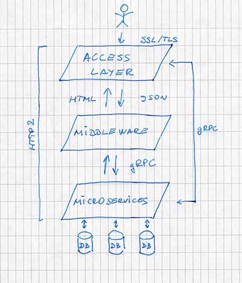

```.header
Title: How To Start With Microservices
Subtitle: Start with microservices today and be read for future challenges
Description: The simplest microservices patterns implemented today play an important role for the things coming tomorrow.
Image: how-to-start-with-microservices.jpg
Author: Djordje Zekovic @zekome
Date: 3 October 2016
Tags: microservices
```

`.video 185295537`

> How to start with microservices if you can’t see the Sun because of all those technical decisions standing in your way? The answer is easy.

Microservices are loosely coupled software components responsible for some part of business logic that is self-contained. It means that changing a microservice doesn’t require changing any other part of the system. And you don’t need to know the whole system to implement one.

You can look at microservice as independent product and the team behind it as self-sufficient vendor. With microservices architecture you can expect many benefits, such as, boosting productivity, or achieving shorter time to value.

Technology decisions on monolithic or microservices architecture can be challenging. When you consider scaling with microservices there are plenty of yet more complexities to come. It might send you away at start; such as containers orchestration, security, clustered logging, continuous delivery, or even moving to the cloud. How to start with microservices? Let's apply simplicity wisdom from the start.

> Premature optimization is the root of all evil. - Donald Knuth

The best web architecture to start with would be the one that enables continuous delivery - today. It's an architecture that doesn't imply rewriting everything tomorrow when you’ll need to scale fast. At start it should be like a guarantee that the train will arrive at your place. The simplest microservices patterns implemented today play an important role for the things coming tomorrow.

That's exactly what we want to do. Start microservices today and be read for future challenges. You can look at it as an ongoing process. We go with simplest microservices playground at once with moving our domain to AWS cloud.

The major goals are to unlock platform for continuous delivery, to spin up cloud resources efficiently on demand in cost-effective manner, and to significantly improve time-to-market for new products.

Notes from identifying the key technical requirements might be useful for others who also want to start microservices today.



* There will be 3 layers with different roles and purposes. **Access layer** will handle requests from end-users. **Middleware layer** will handle web page and JSON rendering. And **Microservices layer** will handle specific business logic and will provide services to other layers. You need only the first two layers implemented and still have something upgradable with microservices tomorrow.

* All layers should primarily support HTTP2 as underlying transport protocol. It’s a binary protocol that enables resource retrieval through single connection minimizing communication overhead. During last 12 months 9% of top web sites have already implemented HTTP2 according to [w3techs](https://w3techs.com/technologies/comparison/ce-http2,ce-spdy).

* All layers will support RPC interfaces that are primarily exported by microservices. RPC interfaces will be built on [gRPC](http://www.grpc.io/) framework. That way RPCs will work across languages and platforms.

* **Access layer** is responsible for traffic encryption using SSL/TLS. Web application routing, load balancing, health checking, HTTP headers overwriting, API endpoint aggregation, all will be also handled at this level. One important purpose of access layer is to remove transportation burden from other layers. It's an armor for the rest of infrastructure.

* **Middleware layer** will render web pages and JSON responses. Something similar to view component of MVC framework. It will optionally talk to microservices depending on particular nature of request.

* **Microservices** will be self-contained. Data store will be separated for each microservice. The microservices layer abstracts so much more than just data.

* All layers can be easily scaled out, or containerized independently of each other. It's important to be in cloud and have infrastructure resources just few clicks away. Service discovery, cluster management, and inter-component security are out of consideration right now. However, it all can be implemented as part of an ongoing process later. For start, all above layers can be run as separate system processes on single machine instance. **You can grow from there.**

Now, let me share some words about the current structure of zeko.me domain backend. We have implemented only 2 of 3 planned layers along with moving our domain to the cloud.

The blog subsystem already existed as separate web application. That’s why we have now the designated renderer and a separate web application coexisting in the middleware layer. It’s just a temporary tail of migration process.

The next step is to export interfaces for blog services from microservices layer. It will be an actual implementation of the microservices layer. We are still building the tracks for the train to come.
