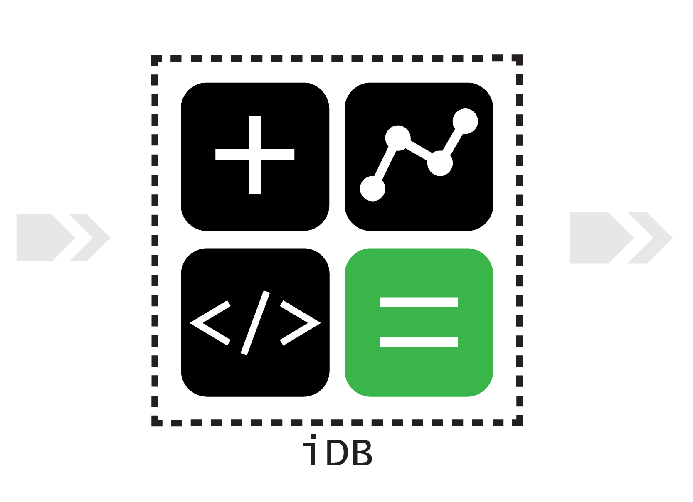

```.header
Title: Inteligentni Data Blok
Subtitle: Analiza podataka i Softverska infrastruktura
Description: iDB - Inteligentni Data Blok, omogućava organizacijama da sa lakoćom donesu prave poslovne odluke na osnovu uvida u podatke.
Image: idb.png
Author: Djordje Zekovic @zekome
Date: 30 April 2017
Tags: idb
Lang: sr, sh, hr, bs
RefLang: /intelligent-data-block/index.md
```



iDB blok je nedostajući dio slagalice,  odgovor na sve više prisutan problem sa kojim se susreću srednje i veće organizacije, a to je nemogućnost da se sa lakoćom donesu prave poslovne odluke na osnovu uvida u podatake.

> Možete imati podatke bez informacije, ali ne možete imati informaciju bez podataka. 
> – Daniel Keys Moran, programer

Kompanije su bogate brojevima, raspolažu sa podacima, ali su i dalje siromašne pravim uvidom u te podatke. Bez obzira na obećanja BigData i velikih poslovnih softvera u dijelu stvaranja novih mogućnosti, kompanije su i dalje zadržane od stvarnog otključavanja tih mogućnosti i približavanja dragocjenom uvidu u podatke.

Nefleksibilnost, loš kvalitet podataka i slične prepreke ometaju uspješno stvaranje analitike za organizacije koje se u upravljanju vode podacima. Obećano saznanje koje bi trebalo da  slijedi nakon implementacije BigData i velikih poslovnih sistema je besmisleno bez pravog upotrebnog konteksta i stvarne mogućnosti da se sistem suzi do onih individualnih metrika koje su bitne za donošenje biznis odluka.

### Platforma
   
iDB uvodi analizu podataka koja zapravo proizvodi primijenjive rezultate. Moći ćete da identifikujete podatke koji su u najboljoj korelaciji sa biznisom, koje su to brzo promijenljive metrike najbolji pokazatelji rasta i koji su to ključni indikatori za donošenje odluka. iDB blok je direktno povezan sa procesom - pametni blok sa direktnim ulazom u pravu analizu radi donošenja odluke A ili B kao konačni ishod.

Radi se o platformi koja pomaže da se poveća brzina, pouzdanost i kvalitet analize podataka. Cilj je omogućiti organizacijama da brzo ostvaruju realan uvid u podatke, da konvertuju taj uvid u operativnu aktivnost, a zatim, da kontinuirano poboljšavaju operacije analitike i njene performanse. Sistem se prirodno naslanja na već implementirana BigData rješenja i poslovne softvere na performantni i pouzdan način. Zauzvrat, postiže se kraće vrijeme do cilja.

iDB je kombinacija alata, raznih poboljšanja procesa, analize podataka i prateće softverske infrastrukture koja omogućava brzo-reagujuću analitiku na visokom nivou kvaliteta i fleksibilnosti. Lako se prilagođava prema korisničkim zahtjevima sa ciljem da se podrži donošenje pravih poslovnih odluka.

Platforma obezbijeđuje jednostavan ulaz sirovih podataka, agilno procesiranje i koncizan izlaz proizvedenih podataka, što omogućava da se sistem lako proširuje i kontinuirano poboljšava u svim dijelovima. Rezultat je brzo-reagujuća, fleksibilna i robustna analiza podataka, koja može da prati kreativnosti internih učesnika i korisnika. iDB samo komplementira donošenje pametnih biznis odluka.

### Inteligentni podaci na izlazu

Od vas se očekuje samo da pokažete na izvore sirovih podataka. Mi implementiramo iDB blok - izvlačimo i analiziramo podatke, ostvarujemo korisničke zahtjeve i omogućavamo svu potrebnu softversku infrastrukturu.

