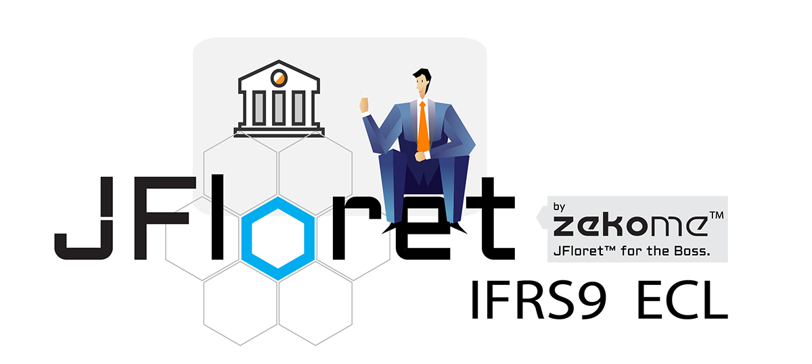

```.header
Title: JFloret™ IFRS9 ECL
Subtitle: Softversko rješenje za implementaciju IFRS9 standarda
Description: Pokriva kalibraciju parametara (PD, LGD, SR i sl.), staging, forward-looking podešavanja, ekspertska prilagođavanja, ECL kalkulaciju i upoređivanje različitih scenarija.
Image: jfloret_ifrs9_ecl.png
Author: Djordje Zekovic @zekome
Date: 31 December 2018
Tags: jfloret
Lang: sr, sh, hr, bs
RefLang: /jfloret-ifrs9-ecl/index.md
```

Među ambicioznim razvojnim projektima u 2018 godine je definitivno bio i **JFloret™ IFRS9 ECL** softver, koji omogućava integrisano okruženje za implementaciju IFRS9 standarda.



Zajedno sa našim [**JFloret™ Macro Modeler-om**](/cg/blog/jfloret-macro-modeler-objavljen/), zadovoljava sve potrebe za izračunavanje očekivanog kreditnog gubitka (ECL) za banke i slične finansijske organizacije.

Softver pokriva kalibraciju parametara (PD, LGD, SR i sl.), staging, forward-looking podešavanja, ekspertska prilagođavanja, ECL kalkulaciju i upoređivanje različitih scenarija kroz interaktivnu vizuelizaciju. Sve je dizajnirano tako da može da zadovolji i zahtjeve bilo koje  proizvoljne IFRS9 metodologije i dinamičnog izvještavanja.

JFloret™ platforma omogućava jednobrazno korisničko iskustvo nad našim [**inteligentnim data blokom**](/cg/blog/inteligentni-data-blok/) (iDB) i drugim distribuiranim procesiranjem između nodova. Svime se upravlja iz centralne aplikacije, a funkcionalnosti su udaljene samo nekoliko klikova.

Platforma podržava procesiranje velike količine podataka i skalabilna je na svakom nivou. Kao dio naše familije alata za analitiku i izvještavanje, softver se može još više eksploatisati od strane naših najzahtjevnijih korisnika u skladu i sa njihovim drugim potrebama generalno - ne samo za ECL.
