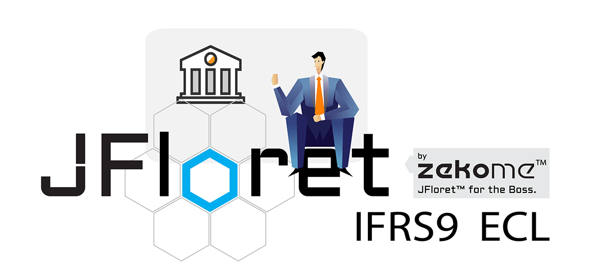

```.header
Title: JFloret™ IFRS9 ECL
Subtitle: A software solution that provides an integrated environment for implementation of IFRS9 standards
Description: t covers parameters calibration (PD, LGD, SR, etc.), staging, forward-looking adjustments, expert’s adjustments, ECL calculation, and provides different scenario comparison.
Image: jfloret_ifrs9_ecl.png
Author: Djordje Zekovic @zekome
Date: 31 December 2018
Tags: jfloret
```

Among the most ambitious development projects in 2018 year was definitely the **JFloret™ IFRS9 ECL** software, which provides an integrated environment for implementation of IFRS9 standards.



Altogether with our [**JFloret™ Macro Modeler**](/blog/jfloret-macro-modeler-released/), it fulfils the most common needs for expected credit loss (ECL) calculation for banks and similar financial organizations.

It covers parameters calibration (PD, LGD, SR, etc.), staging, forward-looking adjustments, expert’s adjustments, performs ECL calculation, and provides different scenario comparison through interactive visualization. It’s designed to suit any custom IFRS9 framework and reporting needs.

JFloret platform delivers the seamless customer experience over our [**intelligent data block**](/blog/intelligent-data-block/) (iDB) and other distributed computing between all nodes. It’s all managed from the central application, always just few clicks away. 

The platform is capable of processing the huge amount of data and it’s scalable at each level. And as part of our reporting and analytics product family it can be even more exploited for our most demanding customers and their wide  needs in general - not just ECL.
