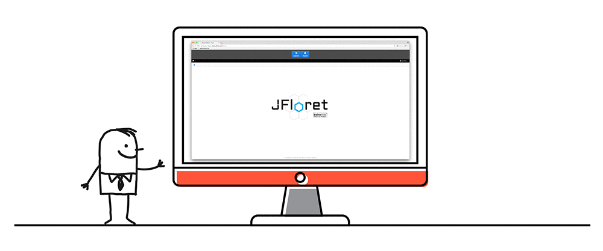

```.header
Title: JFloret™ Macro Modeler - Objavljen
Subtitle: Softversko riješenje za kvantifikovanje uticaja makroekonomskog okruženja na portfolio banke
Description: Naš novi proizvod JFloret™ Macro Modeler predstavlja idealno softversko riješenje za kvantifikovanje uticaja seta indikatora na razvoj portfolija banke.
Image: jfloret_macro_modeler.png
Author: Djordje Zekovic @zekome
Date: 08 March 2018
Tags: jfloret
Lang: sr, sh, hr, bs
RefLang: /jfloret-macro-modeler-released/index.md
Stealth: yes
Noindex: yes
```

Uvođenjem novih standarda izvještavanja MFSI9, javlja se rastuća potreba za kvantifikovanjem uticaja makroekonomskog okruženja na portfolio banke, standardizaciju i automatizaciju ekonometrijskog modeliranja. Jedan od zahtjeva standarda odnosi se na definisanje predikcionog modela očekivanog gubitka, pri čemu parametri modela treba da uzmu u obzir sva relevantna buduća kretanja tržišta i makroekonomskog okruženja - interni i eksterni uticaj.


Naš novi proizvod **JFloret™ Macro Modeler** predstavlja **idealno softversko riješenje** za kvantifikovanje uticaja seta indikatora na razvoj portfolija banke. Softver je vrlo jednostavan za korišćenje i široke je primjene - MFSI9, stresno testiranje, ICAAP, procjena vrijednosti kolaterala i slično.

Indikatori se zadaju kao nezavisne varijable, koje nisu nužno ograničene samo na makroekonomske indikatore. Razvoj portfolija banke se definiše zavisnim varijablama, kao što su vjerovatnoće default-a, stope gubitaka, vrijednosti hipoteka itd. Kroz implementaciju algoritama mašinskog učenja (eng. machine learning) sistem na efikasan način omogućava kvantifikovanje uticaja odabranih indikatora.



Od korisnika se ne zahtijeva visok nivo ekspertize iz oblasti ekonometrijskog modeliranja. Implementiramo različite metodologije i omogućavamo testiranje višestrukih screnarija. Broj simulacija je neograničen, simulacije se skladište, pa je moguće porediti različite pristupe u modeliranju.

> Kada su u pitanju podaci, ‘što prije to bolje’ je uvijek najbolji odgovor.
>
> – Marissa Mayer, Yahoo! direktor

Ukoliko želite da budete jedan skok ispred svih, slobodno nas kontaktirajte kako bi organizovali prezentaciju,  odgovorili na sva vaša pitanja u vezi sa makro modeliranjem i vidjeli šta kažu podaci - ‘što prije to bolje’.
