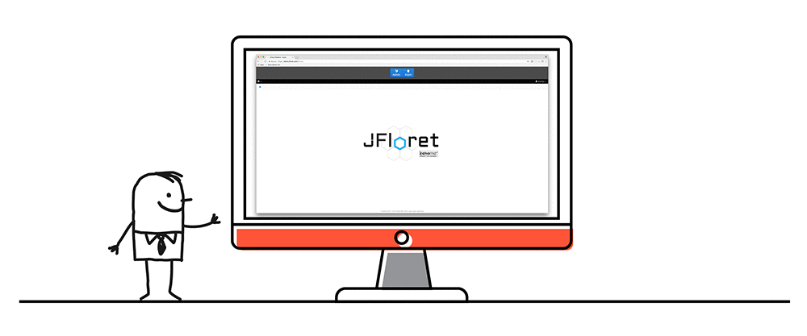

```.header
Title: JFloret™ Macro Modeler - Released
Subtitle: A software solution for quantification of macroeconomic environment effects on the bank portfolio
Description: Our new software product JFloret™ Macro Modeler is an ideal solution for quantification of effects of different indicators on the bank portfolio.
Image: jfloret_macro_modeler.png
Author: Djordje Zekovic @zekome
Date: 08 March 2018
Tags: jfloret
Stealth: yes
Noindex: yes
```

Introduction of the new IFRS9 standards increase the necessity for quantification of macroeconomic environment effects on the bank portfolio, modeling standardization and automation. One of IFRS9 requirements refers to the expected credit loss forward-looking modeling, where each calibrated parameter should take into account any future market and macroeconomic environment changes - internal and external effects.


Our new software product JFloret™ Macro Modeler is an ideal solution for quantification of effects of different indicators on the bank portfolio. It’s user friendly and covers wide spectrum of application - IFRS9, stress testing, ICAAP, collateral re-evaluation etc.

Indicators are given as independent variables, and they are not limited only to available macroeconomic indicators. The portfolio development is measured by probability of default, loss rate, loan to value ratio, which are given as dependent variables. The software efficiently provides quantification of effects of selected indicators supported by machine learning algorithms.



A user is not required to be an expert in field of econometric modeling. The software implementation includes different modeling methodologies and allows testing of multiple modeling scenarios. The number of simulations is unlimited, and every successful simulation is saved, which allows comparison of different modeling approaches.

> With data collection, ‘the sooner the better’ is always the best answer.
>
> – Marissa Mayer, CEO Yahoo!

If you want to be one jump ahead of the game, feel free to contact us in order to arrange presentation, answer all your questions regarding macro modeling, and let’s see what the data says - ‘the sooner the better’.

