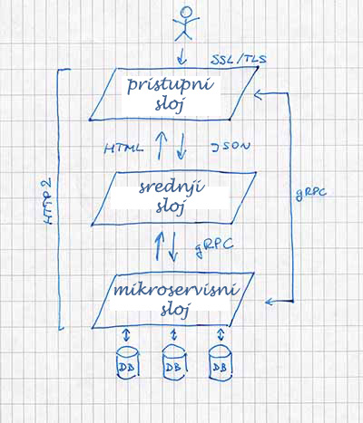

```.header
Title: Kako Započeti Sa Mikroservisima
Subtitle: Započnite sa mikroservisima još danas i budite spremni za izazove u budućnosti
Description: Najprostiji šabloni mikroservisa implementirani danas igraju bitnu ulogu za stvari koje tek dolaze
Image: kako-zapoceti-sa-mikroservisima.jpg
Author: Djordje Zekovic @zekome
Date: 3 October 2016
Tags: mikroservisi
Lang: sr, sh, hr, bs
RefLang: /how-to-start-with-microservices/index.md
```

`.video 185295537`

> Kako startovati sa mikroservisima, ako ne možete ni vidjeti Sunce zbog svih tehničkih odluka koje vam stoje na putu? Odgovor je lak. 

Mikroservisi su zasebne i lako spojive softverske komponente zadužene za neki dio samostalne biznis logike. To znači da izmjena mikroservisa ne zahtjeva izmjenu u ostalom dijelu sistema. Takođe ne morate znati čitav sistem da bi implementirali mikroservis.

Na mikroservis možete gledati kao na nezavisni proizvod, a tim koji stoji iza razvoja tog proizvoda kao na samostalnog dobavljača. Sa mikroservisnom arhitekturom možete očekivati brojne benefite, kao na primjer, poboljšanje produktivnosti, ili postizanje kraćeg vremena od zahtjeva do realizacije.

Tehničko opredjeljenje između monolitne i mikroservisne arhitekture može biti izazovno. Kada razmatrate skaliranje sa mikroservisima postoji još dosta kompleksnosti. To može odvratiti nekog na samom startu; kao na primjer upravljanje kontejnerima, sigurnost sistema, klasterizovano logovanje, kontinuirana isporuka, a možda čak i migracija na Oblak. Kako započeti sa mikroservisima? Hajde da primjenimo jednu mudrost jednostavnosti od samog starta.

> Prevremena optimizacija je korjen svih nevolja. - Donald Knuth

Najbolja web arhitektura sa kojom možete početi je ona koja omogućava kontinuiranu isporuku - i to danas. To je arhitektura koja ne podrazumjeva ponovno kodiranje svega sjutra kada treba da skalate brzo. U početku to bi trebalo samo biti kao garancija da će voz stići i do vašeg mjesta. Najprostiji mikroservisni šabloni implementirani danas igraju bitnu ulogu za stvari koje dolaze u budućnosti.

To je upravo ono što želimo da odradimo. Da započnemo sa mikroservisima danas kako bi bili spremni za buduće izazove. Na sve to možete gledati kao proces koji je u toku. Startujemo sa najprostijim mikroservisnim igralištem uporedo sa migracijom našeg domena na AWS oblak.

Glavni ciljevi su da otvorimo platformu za kontinuiranu isporuku, da zavrtimo resurse u Oblaku efikasno prema potrebi na troškovno efektivan način, i na kraju, da značajno popravimo vrijeme do izbacivanja proizvoda na tržište.

Zabilješka ključnih tehničkih zahtjeva može biti korisne drugima koji takođe namjeravaju da krenu sa mikroservisima.



* Postojaće 3 nivoa sa različitim ulogama i namjenama. **Pristupni sloj** je zadužen za obradu zahtjeva krajnjih korisnika. **Srednji sloj** procesira generisanje web stranica i JSON odgovora. **Mikroservisni sloj** je zadužen za specifičnu biznis logiku i pružanje tipskih servisa do ostalih slojeva. Potrebna su samo prva dva sloja da bi i dalje imali nešto nadgradivo sa mikroservisima sjutra.

* Svi slojevi primarno moraju da podržavaju HTTP2 kao noseći transportni protokol. To je binarni protokol koji obezbijeđuje prenos resursa kroz istu konekciju smanjujući dodatnu komunikaciju. Tokom zadnjih 12 mjeseci oko 9% vodećih web sajtova je već implementiralo HTTP2 u skladu sa [w3techs](https://w3techs.com/technologies/comparison/ce-http2,ce-spdy).

* Svi slojevi će podržavati RPC interfejse koji se prvenstveno eksportuju od strane mikroservisa. RPC interfejsi će biti bazirani na [gRPC](http://www.grpc.io/) standardu. Na taj način RPC pozivi će funkcionisati nezavisno od izbora programskih jezika ili programerskih platformi.

* **Pristupni sloj** je zadužen za enkripciju saobraćaja koristeći SSL/TLS specifikaciju. Web rutiranje, balansiranje saobraćaja, provjera stanja, prepisivanje HTTP zaglavlja, API agregacione tačke, takođe će biti sve uključeno na ovom nivou. Jedna glavna uloga pristupnog sloja je da ukloni teret vezano za pristupni transport u dijelu drugih slojeva. To je kao štit za ostatak infrastrukture. 

* **Srednji sloj** će generisati web stranice i JSON odgovore. Nešto slično poput "pogled" komponente u MVC kosturu. Opcionalno, postojaće komunikacija sa mikroservisima u zavisnosti od prirode tekućeg zahtjeva.

* **Mikroservisni sloj** će biti samoodrživ. Skladište podataka će biti razdvojeno po mikroservisima. Bitno je znati da mikroservisni sloj apstrahuje mnogo više od samo podataka.

* Svi slojevu mogu lako da se proširuju, ili da se ubacuju u kontejnere nezavisno jedan od drugog. Važno je da se sve nalazi u Oblaku i da je infrastruktura svega par klikova blizu. Otkrivanje servisa između sebe, menadžment klastera i sigurnost između komponenata su trenutno van okvira razmatranja. Mada, sve to može biti implementirano u hodu kasnije. Za početak, svi navedeni slojevi mogu da se izvršavaju kao nezavisni sistemski procesi na jednoj instanci virtuelne mašine. **Odatle se može rasti dalje.**

A sada, bih da podijelim par riječi o strukturi sistemske pozadine, koja stoji iza zeko.me domena. Implementirali smo svega 2 od 3 planirana nivoa zajedno sa uporednim prebacivanjem domena na Oblak.

Blog podsistem je već postojao kao zasebna web aplikacija. Zbog toga sada imamo opisanu procesionu tačku i nezavisnu web aplikaciju da koegzistiraju u srednjem sloju. To bi trebala biti samo privremna zaostavština faznog migracionog procesa.

Naredni korak je da eksportujemo interfejse za blog servise iz mikroservisnog sloja. To će zapravo biti prava implementacija mikroservisnog sloja.

U planu je izrada još jednog mikroservisa. Biće zadužen za prikupljanje najnovijih video materijala, automatski, sa Vimeo privatnih albuma. To će omogućiti lančano uvezano objavljivanje materijala za našu [tablu za pisanje](/cg/tabla/). Postavite novi video materijal na Vimeo i on se već nađe na tabli.

Mislim da smo nekako već sada na putu za kontinuiranu isporuku, ali još uvijek izgrađujemo kolosjek za voz koji tek dolazi.
