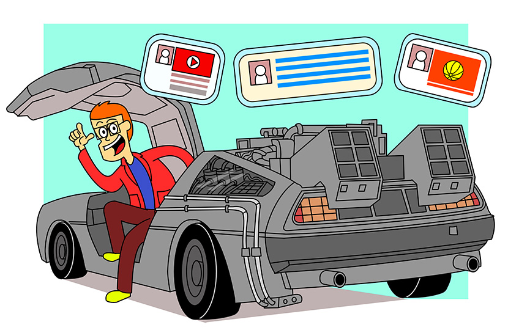
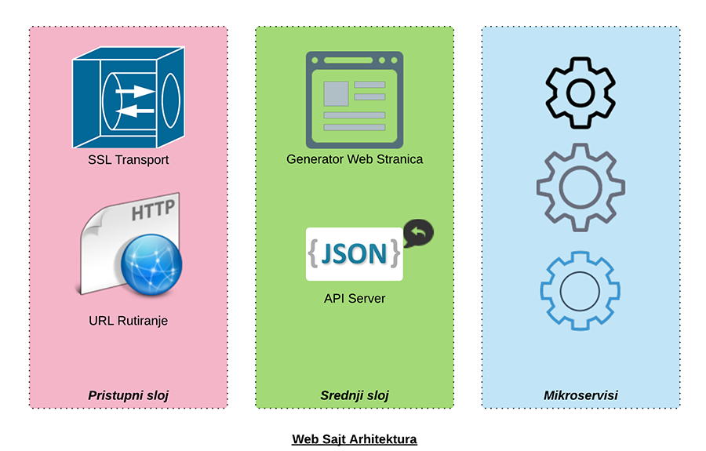
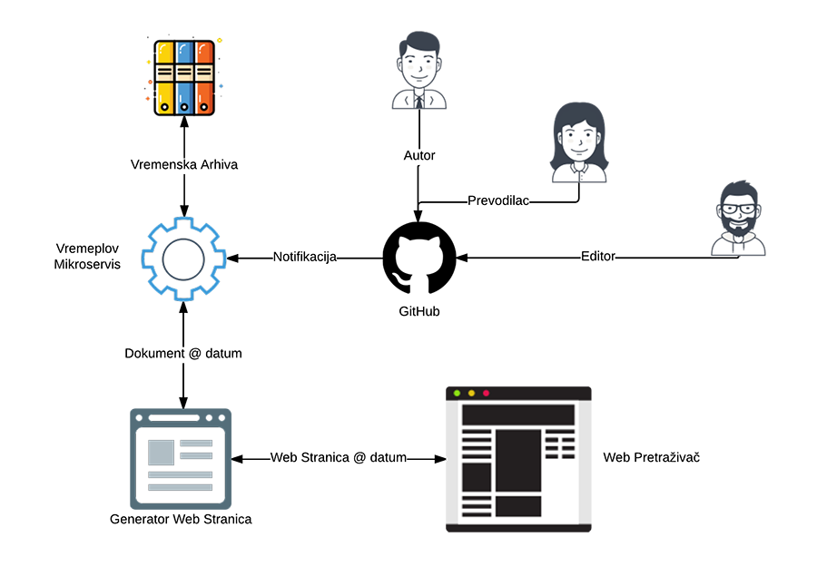

```.header
Title: Nabavite Vremeplov Za Vaš Blog
Subtitle: Ovo nije još jedan pokušaj da se napravi vremenska mašina, mi smo u tome uspjeli
Description: Mikroservis koji se brine o našoj javnoj dokumentaciji i blog zapisima - omogućava vremensku arhivu nad sadržajem.
Image: delorean.jpg
Author: Djordje Zekovic @zekome
Date: 22 February 2017
Tags: mikroservisi
Lang: sr, sh, hr, bs
RefLang: /get-time-machine-for-your-blog/index.md
```



Implementirali smo mikroservis koji se brine o našem blogu i javnoj dokumentaciji. To malo parče softvera omogućava vremensku arhivu dokumenata. Promjene se prate preko Git repozitorijuma. Sve je javno i transparentno, što može biti benefit koji osigurava dodatno povjerenje kod čitalaca.

**Vremenska arhiva**

Zanimljivo svojstvo mikroservisa je vremeplov za putovanje kroz verzije svih zapisa, uključujući i slike. DeLorean mašina vozi do unazad u prošlost sa povratnom kartom. Postoji samo jedno pravilo. Ništa ne smiješ da diraš, možeš samo da gledaš. 

Kada podijelite link do bloga sa prijateljima preko društvenih mreža, sigurno želite da se sadržaj tog blog zapisa više ne mijenja, već da ostane baš onakav zbog čega se vama dopao u tom trenutku. 

**Dodajte @datum na kraju linka i vremeplov garantuje onu verziju sadržaja baš na taj dan.** 

Autori ne moraju više da stavljaju pri dnu blog zapisa da je došlo do neke izmjene, šta su promijenili i slične editorske naznake. Jednostavno održavaju samo zadnju verziju informacije. Ukoliko neko surfuje istorijom bloga, sistem će u samom vrhu web strane da obavijesti da postoji novija verzija. 

Link dodatak *@datum* može uzimate razne oblike, kao na primjer:

- @22022017 - verzija na dan 22.02.2017.
- @022017 - verzija na početak mjeseca Feb 2017.
- @2017 - verzija na početak godine 2017.

## Isprobajte vremeplov

Da bi ste isprobali vremeplov, proletite istim ovim člankom na dan [22.02.2017](@22022017). Razlika je u tome što smo tek kasnije ubacili dijagrame ispod i ovaj pasus - nisu postojali tada.

## Značaj implementacije za nas

Izvorni podaci se nalaze skladišteni na infrastrukturi GitHub-a. Više ne postoji baza podataka u sistemu. Postoje samo dvije komponente - web server i prilagođena struktura informacija. Sistem proširujemo samo sa novim web serverima, a podaci se učitavaju prilikom podizanja servera i drže se u RAM memoriji. 

Sada možemo sa lakoćom da podignemo još jednu instancu web servera u klasteru na određeni period - sve dok ne obradimo trenutno opterećenje, a onda da je ugasimo. To nas svega košta određeni broj dodatnih sati po podignutoj instanci. Prethodni sistem je bio skuplji. Morali smo da unaprijed rezervišemo kapacitete za bazu podataka i da plaćamo istu cijenu bez obzira na opterećenje. Troškovi još rastu sa visoko-dostupnom varijantom baze podataka. Dobro je što više nemamo ovu vrstu troška.

Sa istom lakoćom možemo da postavimo serverske instance u različitim regionima svijeta, ne razmatrajući replikaciju baze podataka između regiona. Dobijamo kraće vrijeme mrežnog odziva od samog korisnika do web servera. 

Ovaj mikroservis za opsluživanje sadržaja nam znači uštedu. Ona se mjeri u manje eura/satu troška i manje sistemske administracije potrebne za održavanje servera.

Saradnicima na projektu kažemo da nam pošalju dokument u standardnom Markdown formatu. Programerima da nam pošalju zahtjev za povlačenje izmjena preko GitHub-a. Nema više onog tereta administriranja CMS sistema. 

*PODSJETNIK: Arhitekturu našeg web sajta smo bazirali u tri sloja sa mikroservisima u pozadini. Prvi je pristupni sloj koji se brine o sigurnosti transporta i rutiranju web zahtjeva po URL putanji. Srednji sloj je zadužen za pripremu HTML odgovora na osnovu kostura web stranice. Mikroservisni sloj opsulužuje samo podatke, a u pozadini odrađuje svu potrebnu logiku za održavanje tih podataka. Sve slojeve možemo da proširujemo po potrebi.*



## Funkcionalni opis

Osnovna funkcionalnost napravljenog mikroservisa je automatizovano učitavanja svih verzija dokumenta sa zasebnog repozitorijuma i priprema određene strukture sadržaja za jednostavno korišćenje u web aplikacijama. Osnovni entitet arhive je dokument i sastoji se od teksta, priloženih slika i drugih fajlova.

## Kolaborativno upravljanje sadržajem

Dokument se može uređivati kroz kolaboraciju više korisnika koristeći Git alat. Uređivački proces je odvojen od same logike softvera. Jedan korisnik može da pripremi prvu verziju sadržaja, drugi korisnik može da ubaci ilustracije, treći može da odradi prevode, a na kraju, zaduženi editori mogu da odrade završne izmjene i objave dokument. Sve može da se dešava javno na GitHub-u ili privatno na BitBucket hostovanom Git repozitorijumu. Onda kada se objavi nova verzija dokumenta, sistem dobija notifikaciju, kada se učitavaju nastale izmjene.



## Markdown sintaksa za stilizovanje teksta

Sadržaj dokumenta se stilski formatira pomoću Markdown sintakse. Bilo koji Markdown editor se može koristiti za pisanje. Mi koristimo ugrađeni Markdown editor na GitHub-u, koji omogućava pogled na već formatirani sadržaj. Osim standardne GitHub Markdown sintakse, uveli smo neke naše sintaksne elemente. To su Markdown sintaksa za ubacivanje video materijala i sintaksa zaglavlja sa osnovnim podacima o dokumentu. Uvijek možemo nadograđivati sintaksu sa novim elementima po potrebi. Mikroservis konvertuje Markdown u HTML sadržaj u letu za svaki API poziv. To omogućava ubacivanje dinamičnog sadržaja unutar dokumenta - poput trenutnog broja ulogovanih korisnika, ili trenutnu vremensku prognozu, možda čak i reklamu.

## Osnovni podaci o dokumentu

Dokument je u arhivi jedinstveno definisan sa svojom putanjom do direktorijuma. Putanja do direktorijuma predstavlja relativnu putanju u arhivi i može se koristiti kao dio web linkova. Unutar direktorijuma se mogu postavljati slike i drugi fajlovi koji čine dokument. Sam tekstualni sadržaj dokumenta se unosi u fajl koji mora imati naziv “index.md”. Pravila su slična kao ona sa direktorijumima i indeks fajlovima na standardnom web serveru. Svaka izmjena u fajlovima predstavlja novu verziju dokumenta.

Svaki dokument ima zaglavlje sa osnovnim podacima. Osnovni podaci su: naslov, podnaslov, opis, vrijeme objave, autori, jezik, oggraph atributi, klasifikacione i druge naznake. Možete označiti dokument kao radnu verziju. Moguće je sakriti dokument iz javnog pregleda naslova.

<pre>
```.header
Title: Nabavite Vremeplov Za Vaš Blog
Subtitle: Ovo nije još jedan pokušaj da se napravi vremenska mašina, mi smo u tome uspjeli
Description: Mikroservis koji se brine o našoj javnoj dokumentaciji i blog zapisima - omogućava vremensku arhivu nad sadržajem.
Image: delorean.jpg
Author: Djordje Zekovic @zekome
Date: 22 February 2017
Tags: mikroservisi
Lang: sr, sh, hr, bs
RefLang: /get-time-machine-for-your-blog/index.md
```
</pre>

## Multijezične varijante 

Dokument podržava multijeznične verzije. U osnovnim podacima mogu da se navedu odgovarajući jezici i osnovna referentna jezična verzija tog dokumenta. Podaci o jeziku su kasnije dostupani unutar API poziva radi pravljenja Google hreflang naznaka za multijezične i multiregionalne web stranice.

Dodavanjem datuma na kraju linka stvara se mnoštvo novih linkova koji vode do “istog” sadržaja, odnosno do različitih verzija u vremenu. Postavlja se pitanje kako će Google i ostali web pretraživači da indeksiraju takve “vremenske” verzije web stranice. Mi smo to riješili upotrebom kanonskih linkova. Svaki vremenski link sadrži i kanonski link do zadnje verzije. Na taj način će Google indeksirati samo zadnju verziju bez obzira na broj vremenskih linkova koji se javno koristi na Internetu.

## Postojanost svega na zadati dan

Vremenska arhiva se ne odnosi samo na to kako je izgledao pojedini dokument na neki dan. Vremenska arhiva pruža funkcionalnosti da prikažete čitav blog sa svim ostalim povezanim člancima u odnosu na taj dan. To znači da, linkovi na *Povezane članake* ili na *Indeks naslova*, takođe vode na vremenski pogled iz zadatog perioda. Osnovno polazište ovakvog ponašanja sistema se ogleda u tome da jedan članak može biti u vezi sa drugim člankom samo ukoliko postoje ta dva članka na isti dan. Ovo je recimo bitno ukoliko izračunavate skup određenih naznaka na određeni datum - šta je sa čim bilo u vezi tada.

Osim što se prati svaka promjena tekstualnog sadržaja dokumenta, vodi se i vremenska arhiva svih fajlova koji idu kao prilog uz dokument. To uključuje i slike. Ukoliko neko promjeni tekst unutar slike, takva izmjena će biti sačuvana i dostupna u arhivi.

## Mogućnost integracije

Ovaj mikroservis se izvršava kao nezavisni proces na sistemu i moguća je API integracija sa postojećim sistemima bez obzira na njihovu tehnologiju izrade. Može biti sastavni dio i vašeg sistema.

## Razvojni put

Trenutno se sve drži u RAM memoriji i svaki put se prevlači čitav sadržaj sa Git repozitorijuma. To je prihvatljivo za veličinu našeg bloga i ostale dokumentacije u ovom trenutku. Za neki veći sadržaj bilo bi potrebno uraditi među-skladištenje na SSD disku, da se ne bi prevlačili svi podaci svaki put. U RAM memoriji bi se onda držali samo oni podaci koji se najčešće koriste.

Vremenska arhiva trenutno ne podržava pretragu. Mi sadržaj objavljujemo javno na sajtu i prepustili smo da Google CSE odrađuje pretragu već indeksiranog sadržaja. Moguće je da ćemo kasnije nadograditi softver sa pretragom unutar zanimljivih logičkih djelova dokumenta (rezime, sadržaj, slike, opšta tematika i sl.). 

## Uvid u arhivu

Naša izvorna arhiva se nalazi na ovom linku:

[https://github.com/zekome/blog](https://github.com/zekome/blog)

Svako može napraviti doprinos našem sadržaju na standardni način  koji omogućava GitHub (zahtjevi za povlačenje izmjena). Isto tako ne moramo prihvatiti svaki zahtjev za izmjenom. Sve se odgirava javno i transparento, što predstavlja vrijednost kao proces sam po sebi. Ovo je odlično.

## Na kraju … linka

Želite da podijelite ovaj članak? Možda da stavite današnji datum na kraju linka i zamrznete trenutnu verziju ovog članka. 


