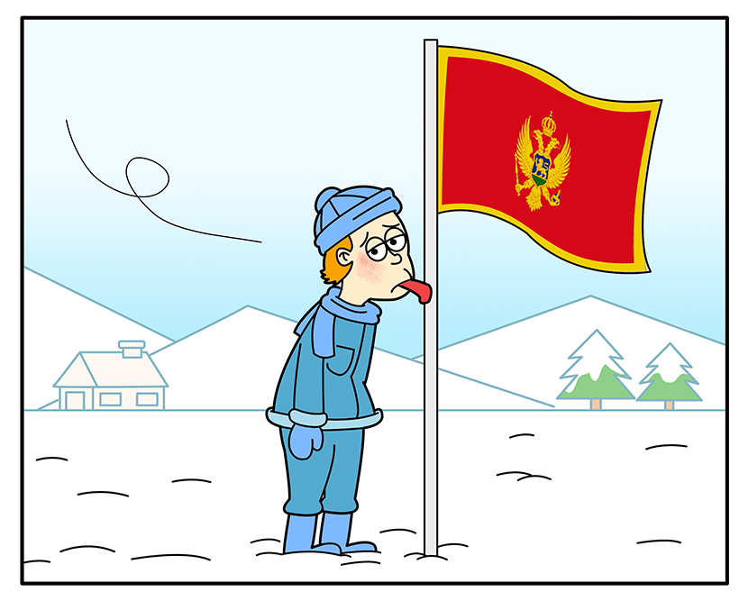
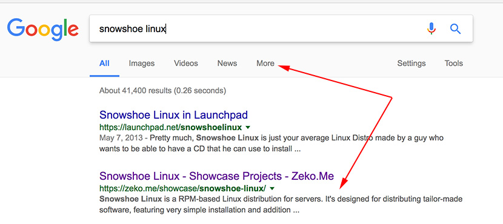
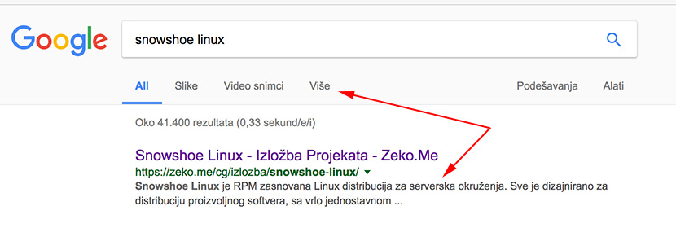
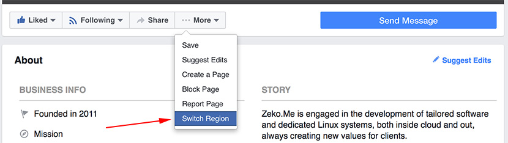
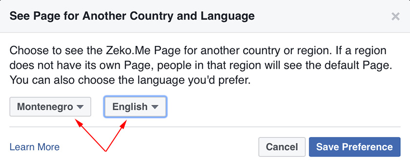
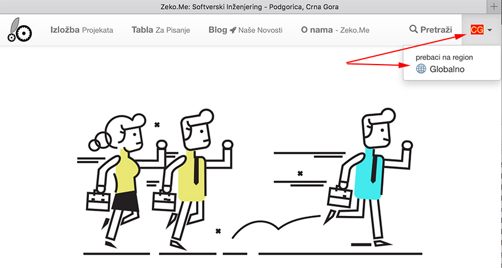

```.header
Title: Prilagođeni Web Sadržaj Za Lokalni Region
Subtitle: Glavni jezik za lokalni sadržaj je ostao zalijepljen za regiju Crne Gore zbog hladnoće
Description: Web sajt smo tehnički podesili prema regiji i govornom jeziku kako bi Google web pretraživač mogao bolje razumjeti našu novu internacionalnu strukturu.
Image: region_crna_gora.jpg
Author: Djordje Zekovic @zekome
Date: 24 January 2017
Tags: novosti
Lang: sr, sh, hr, bs
RefLang: /adjusted-web-content-for-local-region/index.md
```



Web sajt smo tehnički podesili prema regiji i govornom jeziku kako bi Google web pretraživač mogao bolje razumjeti našu novu **internacionalnu strukturu** u cilju prikazivanja odgovarajuće jezične verzije web stranice u rezultatima pretrage. 

Zatim smo prešli na *Facebook globalne stranice* kako bi **odvojili domaći sadržaj** od globalnog prostora u kojem objavljujemo materijal na engleskom jeziku. Sa istom idejom smo iskoristili LinkedIn izložbene stranice za **lokalizaciju** sadržaja i na ovoj mreži. Postoji i [zasebni e-bilten](/cg/bilten/) kako bi pratili naše domaće novosti i bili u toku ostalih zbivanja.

Očekujemo da ćete imati **bolje personalizovano iskustvo** dok boravite u našem onlajn prostoru. U nastavku možete da saznate neke pojedinosti.

### Google pretraga

Ukoliko pretražujete sa lokacijom iz Crne Gore, a pri tom ste podesili *google.me* interfejs da bude na *engleskom jeziku*, onda je očekivano da dobijete web stranicu na istom tom jeziku u rezultatima pretrage.



Slično je kada podesite *google.me* da bude na *crnogorskom jeziku*, kada bi trebali da dobijate rezultat pretrage sa linkom na web stranicu prilagođenu za crnogorski jezik.



Cilj nam je da se u rezultatima pretrage uvijek dobija samo jedan link koji vodi do relevantne jezične varijante web stranice. U našem slučaju to može biti web stranica na engleskom jeziku ili stranica sa domaćim sadržajem predviđena za region lokalno.

### Facebook regionalne stranice
Ukoliko tražite našu stranicu preko Facebook forme za pretragu, a sa lokacijom ste iz Crne Gore, po defaultu će se otvoriti strana sa domaćim sadržajem. U suprotnom, otvoriće se strana sa sadržajem na engleskom jeziku - naša globalna priča. 

Možete sami birati koju verziju želite da pratite i da to upamtite kao stalno podešavanje. Na primjer, ukoliko želite da se prebacite da pratite našu lokalnu priču, to možete uraditi u par jednostavnih koraka.

Pođite na našu Facebook stranicu, a zatim klikom na dugme *More* idete dalje na opciju za prebacivanja regiona - *Switch Region*,


 
zatim u ponuđenoj listi izaberete *Montenegro* kao željeni region i jedan od govornih jezika koji vam najviše odgovara,
 


nakon čega ćete moći da pristupite prilagođenom sadržaju za izabranu regiju. Prilagođeni sadržaj obuhvata i domaće natpise u svim objavljenim video materijalima.

### LinkedIn lokalizacija

LinkedIn izložbene stranice nam se čine kao dobra alternativa za objavljivanje domaćeg sadržaja obzirom da ne postoji prevelika podrška za lokalizaciju na našem jeziku na toj mreži. Domaći sadržaj možete pratiti preko LinkedIn stranice [Zeko.Me CG](https://www.linkedin.com/company/zeko.me-cg).

### Prebacivanje regiona na web sajtu
Već od samog početka, bez obzira da li dolazite sa Facebook mreže ili sa web pretraživača, očekivano je da vas sistem vodi na već prilagođeni sadržaj na sajtu u zavisnosti od vašeg regiona i izbora za jezik, što se detektuje na web platformama sa kojih dolazite do nas. 

Međutim, ukoliko se već nalazite na sajtu, a želite da pristupite prevedenom sadržaju, ili nečemu što je dostupno samo za drugu regiju, možete odraditi *prebacivanje između regiona* koristeći opcije u gornjem desnom uglu unutar pomoćnog menija.




### Neke tehničke pojedinosti, savjeti, naše iskustvo

- Jezik za neko govorno područje se često koristi sa skraćenicama u formatu “jezik-regija”. Standardizacija skraćenih naziva za jezike i regije je obuhvaćena u specifikacijama ISO-639 i ISO-3166, a oznake za identifikaciju govornog jezika su opisane u standardu RFC-3066. Otuda je ispravno en-GB, a nije ispravno en-UK. Pogrešno je za ciljanje crnogorskog jezika koristiti skraćenice *me* ili *mne* - ne postoji u specifikaciji za jezik.
- Interesantno je da Google pretraživač na linku za izbor *crnogorskog jezika* stavlja oznaku *hl=sr-ME*, što će reći *srpski jezik* koji se govori u *regiji Crne Gore*. Ovo je iz razloga što *crnogorski jezik* još nije uključen u standard ISO-639. Onda se postavlja pitanje kako se cilja crnogorski jezik za posjetioce iz na primjer Njemačke? sr-ME-DE? Ne bih rekao.
- Društvene mreže i web pretraživači najčešće uzimaju jezik iz korisničkog podešavanja za jezik aplikativnog interfejsa te web platforme. Što se tiče prepoznavanja regija, tu se koristi detekcija kojoj geografskoj regiji je pridružena IP adresa udaljenog klijenta, dok recimo Google zna dodatno da koristi i koji regionalni Google pretraživač se koristi (google.me, google.de, google.co.uk i slično).
- Facebook regionalne stranice zadržavaju ukupan broj lajkova na svim podstranicama i omogućavaju nezavisne marketinške kampanje, što je odlično. Posebno zanimljiva opcija za podstranice je da za svaki postavljeni video možete podesiti *defaultni* jezik podnaslova nezavisno od drugih podstranica, što omogućava da se uz video pušta uvijek isti podnaslov prilagođen samo za region te stranice. Ovo je jako korisno obzirom da Facebook ne dozvoljava da izaberete sami jezik podnaslova dok gledate video kao što to rade YouTube i Vimeo.
- Da bi Google prepoznao jezične verzije web stranice potrebno je nekih 7 dana. Značajno je napomenuti da Google posmatra podešavanja vezano za ciljanje regiona i jezika više kao signal, a ne kao direktivu koje mora da se strogo pridržava. U konačnu odluku koju će jezičnu verziju da ponudi u rezultatima pretrage je ubrojano mnogo faktora. Podešavanje web sajta je samo jedan od tih faktora, tako da se nemojte začuditi ako ste sve podesili a Google i dalje neće da uzme u obzir “signale” koje mu šaljete.
- Za tehničko podešavanje web stranica za ciljanje regija i govornih jezika koristimo *hreflang* oznake u HTML-u. Bitno je da ste u Google *Webmaster* konzoli dobili informaciju da su svi *hreflang* tagovi prepoznati bez greške. To je jedino mjesto gdje pouzdano možete dobiti informaciju o ispravnosti podešavanja multi jezičnih i multi regionalnih web stranica - onako kako to Google vidi. Svako nestrpljivo eksperimentisanje sa ovim tagovim može da vas košta nove vremenske produžetke dok Google pokupi nastale izmjene. Na primjer, ukoliko jednu te istu stranicu mijenjate često samo zbog hreflang taga, odnosno da ta stranica nema suštinskih izmjena u sadržaju, Google će sve duže i duže da odlaže reindeksiranje takve stranice - a to znači da se mnogo čeka ako se poigravate svako malo.
- Kako isprobati da li podešavanja za ciljanje nekog regiona ili jezika stvarno rade? Nama je trebalo oko 10 dana da dobijemo prve naznake da se nešto dešava i da Google stvarno kalkuliše i uzima u obzir naše signale. Isto tako smo bili penalizovani jer smo neke web stranice prečesto mijenali dok smo se igrali sa hreflang tagovima. Najbolja opcija za test je da koristite IP adrese iz drugog regiona i da tako otvarate interfejs za web pretragu. Druga opcija je da koristite direktan link za Google pretragu i da unutar URL putanje mijenjate parametre *hl* za jezik i *gl* za regiju, što će u većini slučajeva da pokaže isto kao da ste fizički na lokaciji testne regije. Parametar Pws=0 označava da želite da isključite personalizaciju iz podešavanja. 
- Na primjer, da pretražite “snowshoe linux“ za crnogorski jezik i konkretno za regiju Crne Gore, pokušajte sa [ovim linkom](https://www.google.com/search?hl=sr-ME&gl=ME&pws=0&q=snowshoe+linux), a za istu pretragu za engleski jezik probajte sa [izmijenjenim linkom ovdje](https://www.google.com/search?hl=en&gl=ME&pws=0&q=snowshoe+linux).

Da bi Google na kraju “proradio” kako očekujete, može proći prilično dana da se cijela mašina utrenira kako treba. Važno je biti strpljiv, a u međuvremenu, Google to fino kaže, **pravite web stranicu za vaše posjetioce, a ne za web pretraživače.** 
