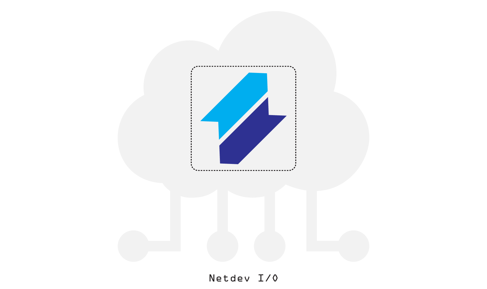
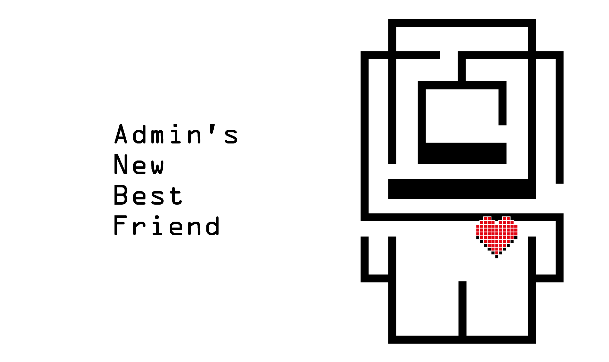
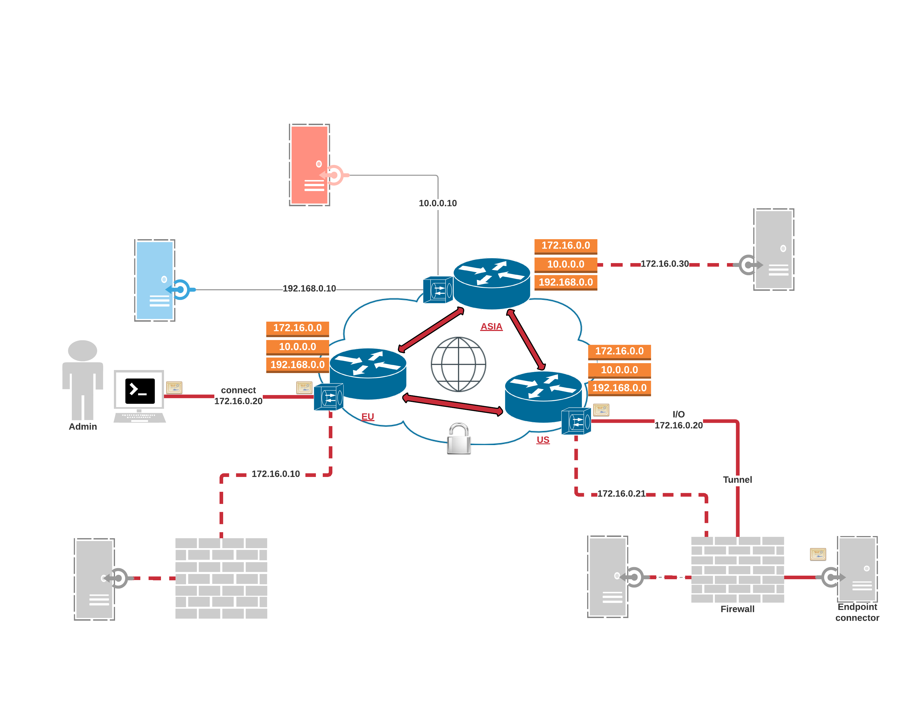

```.header
Title: Project Netdev I/O
Subtitle: Admin’s New Best Friend
Description: One of the goals is to facilitate all things admin for tailored products; to become an admin’s new best friend.
Image: netdev_io_cover.png
Author: Djordje Zekovic @zekome
Date: 20 March 2017
Tags: netdevio
```



Admins are critical to keeping systems, applications, and related infrastructure running. They provision, install, configure, manage, optimize, debug, and babysit different kind of products. A product can be nicely prepared by a vendor for sure. However, it still may require a significant amount of effort and knowledge for someone to deploy it. 

Someone has to take care of software requirements, bring it up for the first time, and keep all things running afterwards. Administration tasks can be time consuming. Necessary technical skills can be long and diverse. An ever-growing multitude of user interfaces can make systems hard to manage. Existing solutions for automating infrastructure, can be an overkill, or just not straightforward. This causes users to become utterly frustrated. They usually fumble through a rough software setup, or even worse, they give up on using a product. 

## The mission
One of the goals is to facilitate all things admin for tailored products; to provide the reliable and secure solution for end-to-end communication and systems administration, regardless if products are used in the cloud, or on-premises; to become an admin’s new best friend.



## A list of what we want

- We want to automate service provisioning for custom products in the cloud and out.
- We want to minimize an effort necessary for the first-time deployments. To provide an effortless as in app store on the mobile phone. 
- We want the end user to enhance efficiency by using one solution where different products work together.
- We want to build hardware/software appliances that are auto-provisioned over Internet; a plug-n-play system that facilitates configuration without user intervention.
- We want to create one place to manage it all; to expose unified administration interface and enable general-purpose communication channels between endpoints.
- We want to separate support levels and delegate privileges accordingly; to provide a compliant audit mechanism and just enough control so could everyone in chain handle common daily operations safely and with clarity.
- We want to enable subscription bundles with add-on cloud services and complement product offerings.
- We want to make easy for independent professionals to do deep administration work across time zones.
- We want to provide integration services to other vendors and service providers; to have their products on the platform and ensure them the same benefits.

## What's cookin' doc?

We are working on three key segments:

- **Netdev Terminal** provides a client line interface over virtual terminal, based in the cloud, mouseless by choice. It’s structured around specific tasks that an admin will want to accomplish. It features strong audit mechanisms and security compliance.
- **Netdev Router** connects multiple endpoints - anywhere and anytime. It provides reliable and secure routes over TCP/IP protocol. Admins can define isolated network subnets with any IP address space, connect between those subnets, and access the same subnet worldwide.
- **Netdev Connector** is designed to support different system architectures, like API for anything, from diverse to specific. It defines a higher protocol for managing service between connected endpoints. It can be a connector for specialized server, web application, system provisioner, IoT, or any custom software. It's always built for a specific product.

The idea is to get only one executable file with built-in Netdev connector. One file per targeted operating system. When started on the device, the little agent connects promptly to the cloud and waits for commands. The executable file can be downloaded, pre-installed on medium, or even built into IoT device.

Admins use CLI to manage remote systems over virtual terminal. They can setup systems in detail, copy-paste recommended configuration, or schedule automatic provisioning rules. The communication channel between endpoints is designated as bidirectional. An endpoint can also initiate communication and access cloud services. For example, endpoints may send an alarm, or trigger some specific protocol logic on the other side. It all depends on connector’s intrinsic protocol.

Endpoints can be located in different geographic regions. An endpoint is connected to the nearest point of presence (POP). It’s always a location with the shortest network round-trip time. Admins connect to the nearest virtual terminal in the same manner - via the quickest network route. All POPs are inter-connected, consist of multiple nodes, and can take over in case of failure.

## The big picture


Red lines show possible routes between connected endpoints across regions - US, EU, and ASIA. For example, endpoints can join deployment sites worldwide for admins to provide managed services and organize assistance during product trials all from one place.

Endpoints are connected over secure tunnels. Peers on both sides of the tunnel are authenticated using certificates. Certificate is integrated in Netdev connector that exports a protocol for managing the product. Altogether we refer to it as an “Endpoint”.

Connected endpoints are accessible over provisioned IP address. A network subnet can be shared between different regions. For example, an endpoint with IP 172.16.0.20 can be located in US, while another endpoint with IP 172.16.0.30 can be located in ASIA; having both IPs belong to the same subnet 172.16.0.0/24, which is accessible between all regions. 

Different type of services can be separated with network subnets. Traffic between subnets is not routed by default, but network peering can be activated. Each subnet is isolated and admins can use any IP numeration. It's much like a global network switch, which connects remote endpoints into private VLAN segments - a local network for administration and service communication.

An endpoint can be located behind NAT or firewall. There can be multiple endpoints behind the same NAT/Firewall. The only requirement is an Internet connection.

Communication between POPs and Endpoints can go both ways.  Endpoints don’t consume any bandwidth when not being managed. Each endpoint uses a separate connection to the nearest POP. 

Admins access endpoints according to granted privileges. Commands are dynamically enabled on established channel. You can access the same endpoint from multiple sessions and run commands concurrently. Commands are paired to work only with specific type of Netdev connector.

## Stay tuned

We have been successfully testing real-world usable scenarios for couple months now. Now, we'll go further with developing, and build the whole thing for production usage. More details will be available as we go forward with the project. Stay tuned until the next update - [Subscribe For Our News](/newsletter/). 
