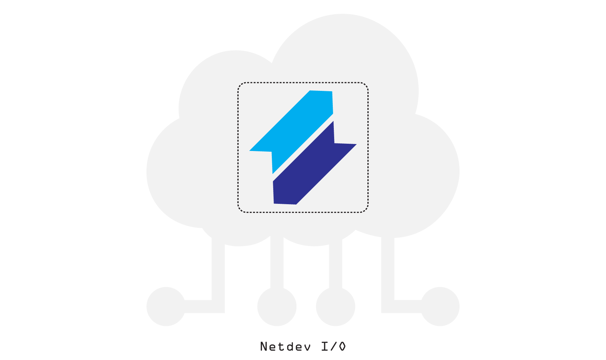
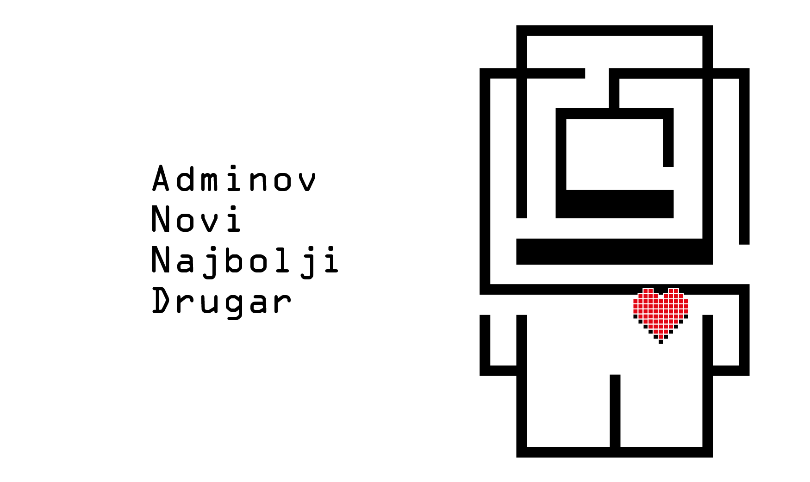
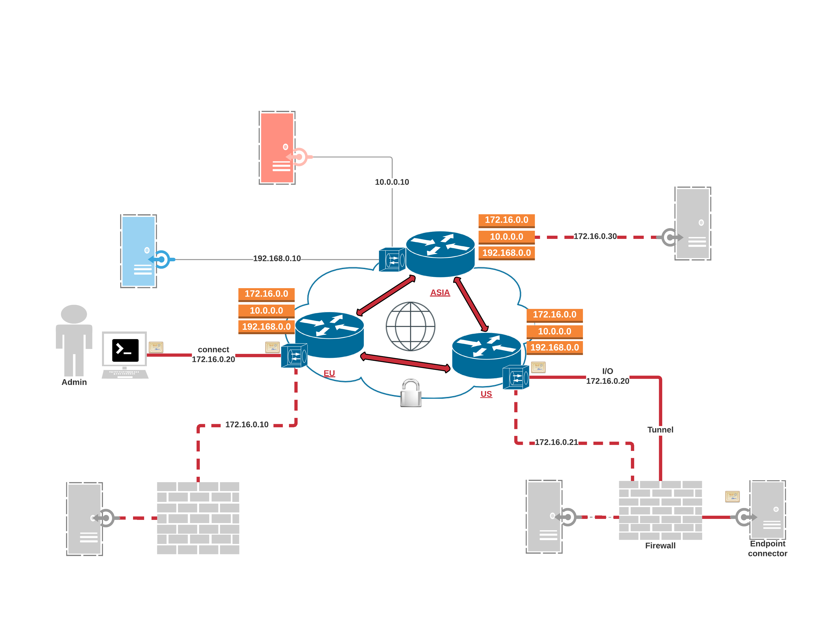

```.header
Title: Projekat NETDEV I/O
Subtitle: Adminov Novi Najbolji Drugar
Description: Jedan od ciljeva je da se olakšaju svi administratorski poslovi u dijelu namjenskih proizvoda; parola je postati adminov novi najbolji drugar.
Image: netdev_io_cover.png
Author: Djordje Zekovic @zekome
Date: 20 March 2017
Tags: netdevio
Lang: sr, sh, hr, bs
RefLang: /project-netdev-io/index.md
```



Administratori su prijeko potrebni za održavanje sistema, aplikacija i prateće infrastrukture. Oni zapravo omogućavaju korišćenje servisa, instaliraju, podešavaju, upravljaju, optimizuju, dijagnostifikuju i održavaju razne proizvode prema uputstvima proizvođača. Sam proizvod može zasigurno biti zgodno pripremljen za upotrebu od strane proizvođača. Međutim, takav proizvod i dalje može zahtijevati značajan napor i znanje osoblja u cilju konačnog puštanja u rad.

Neko na kraju mora da pripremi ispunjenje svih softverskih preduslova, da podesi sistem po prvi put, a zatim da se kontinuirano stara da sve radi besprekorno. Zadaci koji obavljaju administratori znaju da budu vremenski zahtjevni. Lista potrebnih tehničkih vještina može biti svakojaka i dugačka. Raznovrsnost korisničkih interfejsa se svakodnevno povećava što može da otežava upravljanje sistemima.  Postojeća rješenja za automatizaciju infrastrukture mogu biti suviše  kompleksna i ne tako jednostavno primjenjiva. Sve ovo uzrokuje da korisnici postaju apsolutno frustrirani. Oni obično nespretno prolaze kroz gruba softverska podešavanja, ili još gore, odustaju od korišćenja proizvoda.

## Misija
Jedan od ciljeva je da se olakšaju svi administratorski poslovi u dijelu namjenskih proizvoda; da se obezbijedi pouzdano i sigurnosno rješenje za povezivanje i administraciju sistema po modelu sa kraja na kraj, bez obzira na to da li se proizvodi koriste u cloud-u, ili u prostorijama korisnika; parola je postati adminov novi najbolji drugar.



## Lista šta sve želimo da postignemo

- Želimo da automatizujemo podešavanje servisa i pružanje određenih usluga za namjenske proizvode unutar oblaka i van.
- Želimo da smanjimo napor potreban za puštanje sistema u rad. Da omogućimo onakvo “bez napora” kao što je to u prodavnici aplikacija na mobilnom telefonu.
- Želimo da krajnji korisnik poveća efikasnost koristeći jednu soluciju gdje razni proizvodi zaista funkcionišu zajedno.
- Želimo da pravimo hardversko/softverske naprave sa automatskim puštanjem u rad kontrolisano preko Interneta; koristeći sistem za automatsko prepoznavanje koji olakšava podešavanja za puštanje u rad bez intervencije korisnika.
- Želimo da stvorimo isključivo jedno mjesto sa kojeg upravljamo; da predstavimo jedinstveni administratorski interfejs i omogućimo opšte komunikacione kanale između povezanih tačaka.
- Želimo da izdvojimo nivoe pružanja usluga podrške i da delegiramo privilegije shodno tome; da omogućimo standardizovane mehanizme provjere i dovoljne kontrole kako bi svako u lancu mogao da obavlja regularne dnevne operacije sa jasnoćom i na siguran način. 
- Želimo da omogućimo pretplatnički servis u paketu sa raznim cloud servisima i da na taj način dopunimo ponudu samog proizvoda.
- Želimo da olakšamo nezavisnim profesionalcima da obavljaju složene poslove administriranja sistema bez obzira na pomjerenost vremenskih zona.
- Želimo da obezbijedimo usluge integracije ostalim proizvođačima i servis provajderima; da njihove proizvode učinimo dostupnim na platformi, a pri tome osiguravajući im iste benefite.


## Šta se to tamo sprema?

Radimo na tri ključna segmenta:

- **Netdev Terminal** omogućava klijentski upravljački interfejs preko virtuelnog terminala koji se nalazi u cloudu. Nepostojanje potrebe za računarskim mišem je samo stvar opredjeljenja. Netdev terminal je struktuiran oko specifičnih zadataka koje administrator želi da obavi. Klijentski interfejs ispunjava jake sigurnosne standarde i posjeduje mehanizme napredne kontrole.
- **Netdev Ruter** povezuje više krajnjih tačaka - bilo gdje i bilo kad. Omogućava pouzdane i sigurne mrežne putanje preko TCP/IP protokola. Administratori mogu da definišu izolovane mrežne segmente sa bilo kojim IP adresnim prostorom, da prave veze između segmenata i da pristupaju istom (zajedničkom) segmentu iz bilo kojeg regiona svijeta.
- **Netdev Konektor** je dizajniran da podržava razne sistemske arhitekture, kao API generalne primjene, od raznog do specifičnog. Konektor definiše opšti protokol za upravljanje servisima između povezanih krajnjih tačaka. To može biti konektor za specijalizovani server, web aplikaciju, sistem inicijalizator, IoT uređaj, ili bilo koji namjenski softver. Konektor se uvijek pravi i prilagođava prema pojedinačnom proizvodu.

Ideja je da dobijete samo jedan izvršni fajl sa ugrađenim Netdev konektorom. Jedan fajl za ciljani operativni sistem. Kada se pokrene, taj maleni agent se povezuje odmah na cloud i čeka dalje komande. Izvršni fajl može da se skine sa Interneta, preinstalira na medijumu, ili čak ugradi u IoT uređaj.

Administratori koriste CLI interfejs da upravljaju sistemima preko virtuelnog terminala. Oni mogu da detaljno podešavaju sisteme, kopiraju i prebacuju preporučenu konfiguraciju, ili zakazuju pravila za automatsko puštanje u rad. Komunikacioni kanal između krajnjih tačaka je dizajniran kao biderekcionalni. Krajnja tačka može takođe da inicijalizuje komunikaciju i ostvaruje pristup prema potrebnim cloud servisima. Na primjer, krajnje tačke mogu da šalju alarm, ili da pokrenu neku specifičnu protokolnu logiku na drugoj strani. Sve zavisi od unutrašnjeg protokola samog Netdev konektora.

Krajnje tačke mogu da se nalaze u različitim geografskim regionima. Krajnja tačka se povezuje na najbližu lokaciju prisutnosti u tom regionu (eng. PoP - Point of Presence). To je uvijek ona lokacija sa najmanjim mrežnim odzivom mjereno od krajnje tačke. Administratori se povezuju na “najbliži” virtuelni terminal na isti način - preko najbrže mrežne putanje. Sve POP lokacije su međusobno povezane, sastoje se od više instanci i mogu da preuzimaju servis između sebe u slučaju bilo kojeg ispada.


## Velika slika


Crvene linije na slici pokazuju moguće mrežne putanje između povezanih krajnjih tačaka širom regiona - SAD, EU i Azija. Na primjer, krajnje tačke mogu da povezuju implementacione lokacije širom svijeta kako bi administratori mogli da pružaju usluge podrške za iste proizvode i to sve sa jednog mjesta.

Krajnje tačke su povezane preko sigurnosnih tunela. Krajevi sa obje strane tunela se međusobno autentifikuju sa sertifikatima. Sertifikati su integralni dio Netdev konektora i oglašavaju protokol za upravljanje proizvodom. Sve zajedno čini jedan logički entitet koji zovemo “Krajnja tačka”.

Krajnje tačke su dostupne preko dodijeljene IP adrese. Pripadajući mrežni segment može biti zajednički za  upotrebu  između različitih geografskih regiona. Na primjer, krajnja tačka sa IP adresom 172.16.0.20 može biti sa lokacijom u SAD, dok druga krajnja tačka može imati IP 172.16.0.30 sa lokacijom u Aziji; uz to obje IP adrese pripadaju istoj mreži 172.16.0.0/24, koja je kao izolovani mrežni segment dostupna između svih regiona.

Različiti tipovi servisa mogu biti razdvojeni po izolovanim mrežnim segmentima. Saobraćaj između mrežnih segmenata se ne rutira po standardnom podešavanju, ali međusobno povezivanje može biti posebno aktivirano. Svaki mrežni segment je globalno izolovan i administratori mogu koristiti bilo koju IP numeraciju. To je nešto poput globalnog mrežnog sviča za povezivanje udaljenih krajnjih tačaka u privatne mrežne segmente - lokalna mreža za upravljanje i pružanje usluga. 

Krajnja tačka može biti locirana iza NAT-a ili firewall uređaja. Može postojati više krajnjih tačaka iza istog NAT/firewall uređaja. Jedini preduslov je Internet konekcija.

Komunikacija između POP i krajnjih tačaka može da se odvija obostrano. Krajnje tačke koriste mrežni protok isključivo ukoliko se njima trenutno upravlja. Svaka krajnja tačka koristi zasebnu konekciju do najbliže POP lokacije.

Administratori pristupaju krajnjim tačkama u skladu sa dodijeljenim privilegijama. Komande se dinamički omogućavaju unutar uspostavljenog kanala. Možete pristupiti istoj krajnjoj tački preko paralelnih sesija i da izvršavate komande istovremeno. Komande su uparene na način da rade samo sa specifičnim tipom Netdev konektora.

## Ostanite u toku

Već nekoliko mjeseci uspješno sprovodimo testove za razne upotrebne scenarije. Sada, nastavljamo dalje za razvojem i gradimo cijelu stvar za produkcionu upotrebu. Više detalja će biti dostupno tokom napredovanja na projektu. Ostanite u toku do novih informacija.
