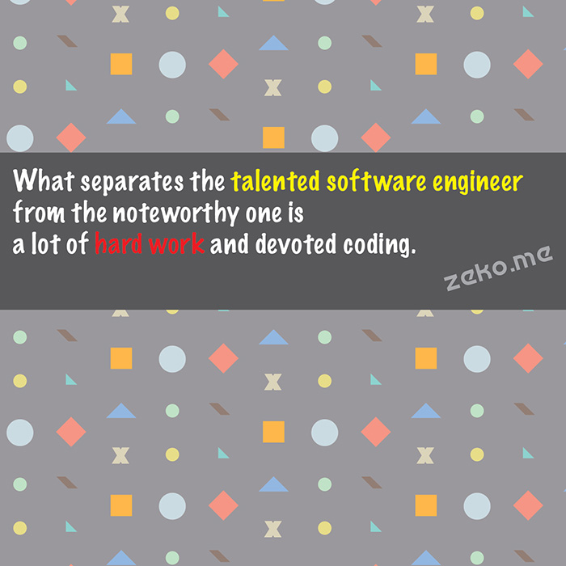

```.header
Title: Talented Software Engineer vs Noteworthy One
Subtitle: Checkout how a quote might have different effect when in video format
Description: What separates the talented software engineer from the noteworthy one? A dude broke his sarcasm sensor while reading.
Image: what-separates-the-talented-software-engineer.jpg
Author: Djordje Zekovic @zekome
Date: 7 October 2016
Tags: venture
```

`.video 185935006`

> What separates the talented software engineer from the noteworthy one? A lot of hard work and devoted coding.

Many grumble on Mondays. And are happy on Fridays. It’s because of the coming weekend. A non-working time. To get really good at what you are doing you can’t skip the hard work. Power up. Code with love. This and every other weekend. And little things will add up to big things. You can be a noteworthy one.

**UPDATE:** The first impressions just arrived. One guy was glad to watch the video because it contains a wealth of knowledge that would help you become a noteworthy engineer. He claims that he, totally, didn't know such knowledge before. Another dude even broke sarcasm sensor while reading the comment. **The message is clear. They expected more.**

The real intention here was to create a video format of some inspiring quote, or important attitude about something. There are no shortcuts to success - a little motive in this particular case. There is no spectacular knowledge to be gained. It's just words to think about. You must have encountered quote-image style so far, like below. I find short videos more compelling in general. Maybe I should have stated this in original post. But, then, how could I receive ownest first impressions.



