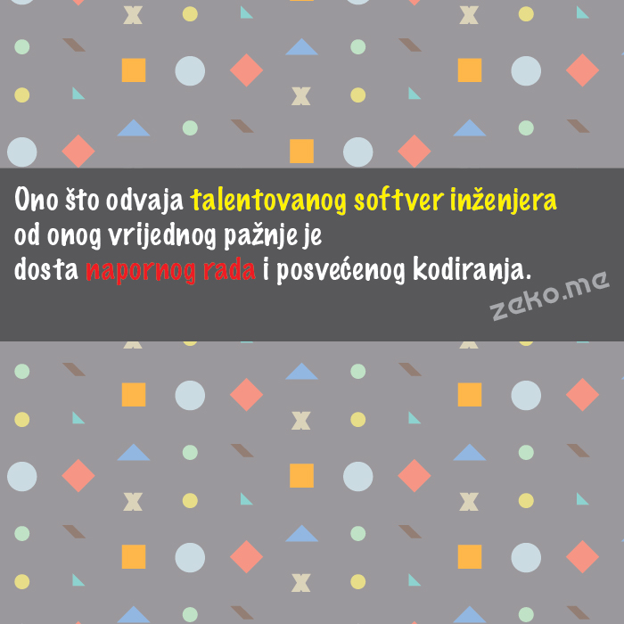

```.header
Title: Talentovani Softver Inženjer Naspram Onog Vrijednog Pažnje
Subtitle: Kako jedan citat može imati drugačiji efekat ako je u video formatu
Description: Šta odvaja talentovanog softver inženjera od onog vrijednog pažnje? Jednom liku je pukao senzor za sarkazam dok je gledao.
Image: ono-sto-odvaja-talentovanog-softver-inzenjera.jpg
Author: Djordje Zekovic @zekome
Date: 7 October 2016
Tags: poduhvat
Lang: sr-ME
RefLang: /talented-software-engineer-vs-noteworthy-one/index.md
```

`.video 185935006`

> Šta odvaja talentovanog softver inženjera od onog vrijednog pažnje? Dosta napornog rada i posvećenog kodiranja.

Mnogi gunđaju ponedjeljkom. A opet srećni su petkom. To je zbog dolazećeg vikenda. Neradno vrijeme. Da bi bili zaista dobri u tome što radite ne možete zaobići naporan rad. Napunite baterije. Kodirajte sa ljubavlju. Ovaj i svaki drugi vikend. Jedno se nadograđuje na drugo. Možete biti vrijedni pažnje.

**AŽURIRANO:** Prvi utisak je upravo pristigao. Jedan lik je bio toliko zadovoljan sa videom zato što sadrži izobilje znanja koje mu može pomoći da postane inženjer vrijedan pažnje. Kako tvrdi, uopšte nije znao za takvo znanje ranije. Drugom liku je čak pukao senzor za sarkazam dok je čitao komentar ovog prvog. **Poruka je jasna. Očekivali su više.**  

Stvarna namjera ovdje je bila da se kreira video format nekog inspirišućeg citata, ili važnog stava o nečemu. Nema prečica do uspjeha - mali motiv u ovom slučaju. Ne postoji nikakvo spektakularno znanje da se otkrije. To su samo riječi o kojima treba razmisliti. Sigurno ste se do sada susreli sa citatima u slici, kao što je prikazano na slici dolje. Lično smatram da je video sadržaj pitkiji od slike. Možda sam sve ovo trebao staviti u prvobitnoj verziji. Ali, onda, kako bih dobio iskrene prve utiske.


