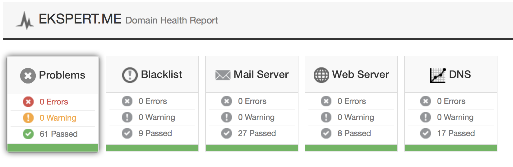
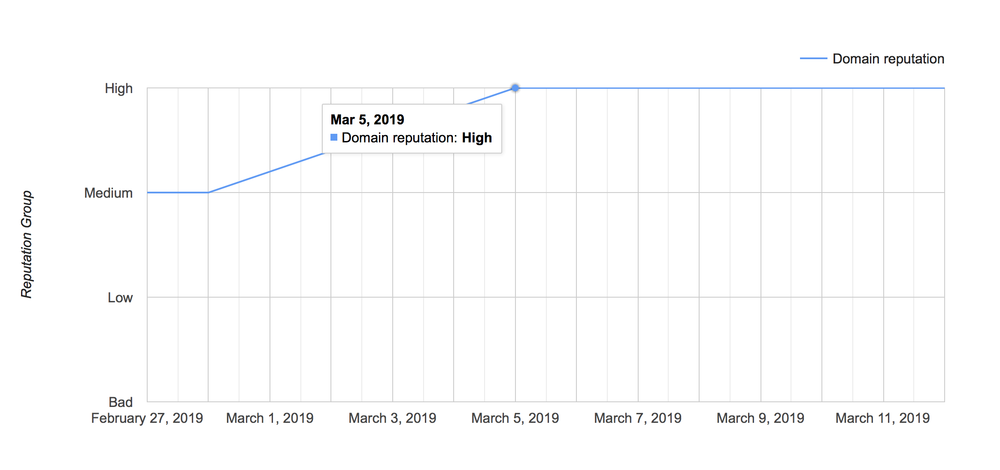
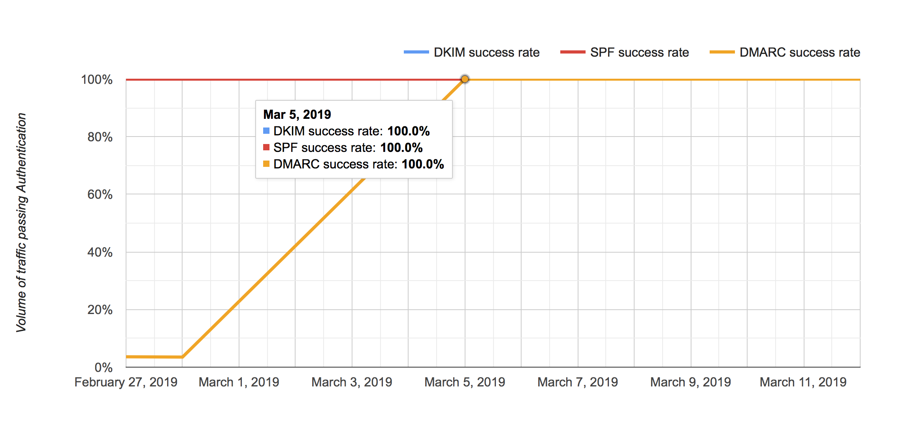
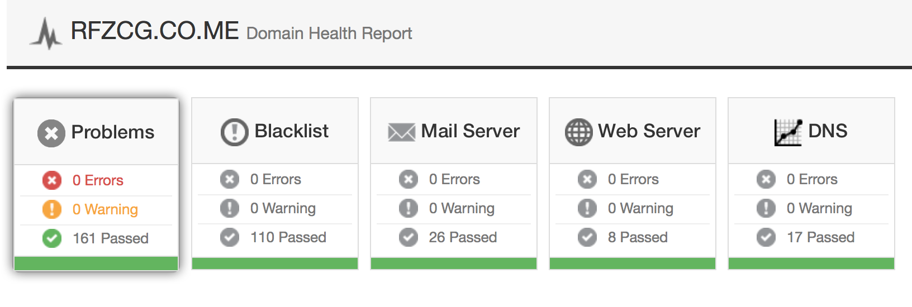

```.header
Title: TuxHat™ Mail Server
Subtitle: Naš mejl server, pažljivo naštimovan za najveću reputaciju domena
Description: Ovo je visoko standardizovano okruženje za mejl servis, koje se sastoji od brojnih i međusobno uvezanih softverskih komponenti, tako da omogućavaju bogate funkcionalnosti u dijelu mejl agenata za transfer i isporuku, servisa za mejl sanduče, webmejl klijenta, spam filtera i antivirusne zaštite.
Image: tuxhat_mail_server.png
Author: Djordje Zekovic @zekome
Date: 21 March 2019
Tags: tuxhat
Lang: sr, sh, hr, bs
RefLang: /tuxhat-mail-server/index.md
```

**TuxHat™ Mail Server** je visoko standardizovano okruženje za mejl servis, koje se sastoji od brojnih i međusobno uvezanih softverskih komponenti, tako da omogućavaju bogate funkcionalnosti u dijelu mejl agenata za transfer i isporuku, servisa za mejl sanduče, webmejl klijenta, spam filtera i antivirusne zaštite - sve dizajnirano za postizanje najveće reputacije vašeg domena, jer primaoci sa druge strane, uvijek prate kako se vaš domen upotrebljava i ponaša kroz svu poštu koju šaljete. Visoka reputacija je ultimativni faktor za uspješnu isporuku mejla.


**Elektronska pošta je važan i nezamjenljiv način komunikacije u poslovanju jedne firme.** Možete izmjestiti elektronsku poštu na web zasnovane servise poput Google aplikacija za poslovne korisnike, ili Office365, to je zasigurno, ali postoje i neki kompromisi. Da pogledamo prvo zašto bi ste izabrali da hostujete **isključivo vaš mejl server**?

**Privatnost.**  Kad god se elektronska pošta smješta negdje drugo, uvijek imate barem mogućnost da neko drugi ima pristup vašim mejlovima. To možda nije važno za vas, ali ako jeste, onda definitivno želite isključivo vaš mejl server i eksplicitan ugovor o povjerljivosti sa integratorom mejl sistema. Postoje i neke druge stvari,  kao na primjer da provajderi mogu da skeniraju vašu poštu kako bi bolje prikazali reklame shodno vašim interesima u zamjenu za njihove besplatne mejl servise. Ima i onih koji se brinu za određene rizične scenarije, kao na primjer da neko institucionalno moćan može da preuzme svu poštu bez vašeg znanja. To nije nemoguće kada imate isključivo vaš sistem, ali je znatno teže.

**Kontrola.** Uvijek znate što se dešava sa vašim mejlom nakon što kliknete na ‘Pošalji’ dugme. Ako se oslanjate na elektronsku poštu kao vid kritične poslovne komunikacije, onda je potrebno da znate da li je mejl isporučen vašim korisnicima, ili partnerima, kao i ko sve šalje poštu u vaše ime. 

Bez obzira da li je mejl primljen, odložen za slanje, nije poslat ili se vraća nazad, vi ćete znati to odmah i znaćete razloge. Imate način da znate zasigurno kroz inspekciju transakcionih zapisa na vašem serveru. Dalje, možete podesiti, kao i mnogo lakše primjenjivati politiku korišćenja servisa, zatim možete automatski dodavati potpise na svaku poslatu poštu, skenirati poruke za određene sadržaje, zahtjevati statuse o isporuci prema drugoj strani, implementirati proizvoljne strategije za arhivu elektronske pošte, itd. - u potpunoj ste kontroli.

**Bez ograničenja.** Niste limitrani sa brojem mejl poruka koje šaljete u nekom vremenskom intervalu, ili limitirani u pogledu  skladištenog prostora po sandučetu, broju primalaca po mejlu, broju i tipu priloženih fajlova, tipu sadržaja, ili veličini mejla. Možete da kreirate isključivo vaše servisne pakete i da uključite limite samo kada je to zaista potrebno.

**Mogućnost isporuke.** Nećete biti odbijeni zbog restrikcija koje su nametnute ili sistemski implicirane zbog ponašanja ostalih na istom sistemu. Akcije ostalih mogu da utiču na isporuku vaših mejlova, jer kada dijelite servise sa još nekim klijentima, onda je isporuka vaše pošte takođe kompromitovana kada ti klijenti urade nešto spamerski. To je glavni problem koji dolazi uz jeftine dijeljene resurse web hostinga, gdje takođe dobijate i dijeljeni mejl servis. Čak i oni najveći, poput Google-a, dolaze na crne liste sve češće zbog dijeljene prirode svog servisa i ogromne baze korisnika koju treba kontrolisati.

**Isplativost.** Većina provajdera naplaćuje mejl servis po korisniku/sandučetu, ili za grupu korisnika. Iznosi su prilično mali danas, pogotovo za manji broj korisnika, ali vremenom sa rastom broja korisnika, to može da predstavlja trošak bez direktne računice isplativost. Sa isključivo vašim Linux-zasnovanim mejl serverom, vrlo je vjerovatno da možete imati korisničkih naloga koliko god je potrebno i kada god se za to ukaže potreba - jednostavno zaboravite na cjenovni model po broju korisnika/sandučeta.  

**Specijalni mejlovi.** Sa isključivo vašim mejl serverom možete imati mejl adrese za posebne namjene, kao pouzdan servis, kao što su to: privatne i javne liste za distribuciju pošte, kopija pošte za domenske naloge, mejl ekstenzije, Internet faks, ‘push’ notifikacije, ili bilo koji mejl usmjereni servis na koji pomislite. Vi dizajnirate pravila, koja postaju dio transakcionog toka obrade elektronske pošte.


## Naše usluge

Na raspolaganju su usluge **migracije korisnika i podataka** kao dio implementacije TuxHat mejl servera. Migriramo vašu postojeću bazu korisnika, zajedno sa njihovim mejlovima, na novi sistem. Nema apsolutno nikakvog razloga da se odupirete ovom izazovu zbog prelaska na novi mejl server. Proces migracije podatka protiče uvijek glatko i bez poteškoća. Pokazaćemo potrebno strpljenje,  upornost, kao i preciznost da migriramo potrebne podatke. 

Možete i da obezbijedite serverski hardver na vašoj lokaciji, ili mi možemo da omogućimo zasebne servere kod vodećih cloud provajdera. Oba načina imaju svoje prednosti i tipične scenarije upotrebe. **Namjenski hosting plan** za vaš mejl sistem može da uvede neke dodatne benefite kao:  veća mrežna propusna moć, bolja dostupnost infrastrukture, redudantne IP adrese sa više alternativnih mrežnih puteva kako bi servis radio bez prekida, brzi transferi rezervnih kopija do skladištenog prostora unutar cloud-a, zaštita od DDoS napada, mejl transakcije preko IPv6 ruta, itd.

Ali, samo mejl server da radi, onako sam od sebe, nije dovoljno.
Možete imati vrhunske funkcionalnosti, ali bez odgovarajuće pažnje od strane postmaster-a, to vjerovatno neće biti održivo na duže staze. Morate da održavate **najveću reputaciju** vašeg domena cijelo vrijeme. Preporučeno je da periodično provjeravate da li šaljete spam, da provjeravate ocjene vašeg domena, stope uspješne autentifikacije mejlova, kvalitet implementacije, greške pri isporuci, itd.

Morate biti veoma pažljivi da bi održali mejl server na nivou prihvatljive komunikacije sa drugima, jer dosta korisnika se oslanja na pouzdanost njihovih mejl servera mnogo više nego na pouzdanost web sajtova. U informatičkom smislu, postmaster je administrator mejl servera i od njega se očekuje da pazi na sveukupno zdravlje mejl servisa.

> Naš mejl server radi bez problema već godinama. Sve poteškoće su uvijek bile brzo otklonjene i vrlo smo zadovoljni sa postmaster uslugama. Sve pohvale za Zeko.Me. - Sreten Šćepanović, Osnivač, KatalogPropisa.me

Pružamo **usluge postmaster administracije**, koje obično uključuju: praćenje korišćenja mejl sistema, monitoring konekcija, analiziranje izvještaja o isporuci, provjera logova, upravljanje mejl protočnim redovima i disk prostorom, pravljenje rezervnih kopija i oporavak, definisanje strategije razmjene mejlova, rješavanje problema sa spamom - sve ovo da bi se samo održala najveća reputacija domena. Gotovo svaki domen treba da ima mejl adrese *postmaster@example.com* i *abuse@example.com*, gdje se žalbe i greške u transakcijama proslijeđuju. Neko se mora pobrinuti za to, a mi to možemo raditi za vas. 

A sada, da skočimo na finalni nivo. Mi doživljavamo **usklađenost** našeg mejl server rješenja sa standardima ozbiljno. Radi se o vrlo usklađenom sistemu u pogledu vodećih industrijskih standarda. Održavamo sistem tako da su svi indikatori u zelenom - iz MxToolbox testova, koji omogućavaju tačnu dijagnostiku za mejl domene.

Na slikama ispod možete vidjeti MxToolbox testove - izvještaj o zdravlju domena (sve zeleno), Google Postmaster Alati - reputacija domena je skočila na Visoko, nakon DMARC nadogradnje i 100% prolaznost autentifikacije za DKIM, SPF i DMARC / sve za domen ekspert(tačka)me, hostovan u cloud-u, na nezavisnom serveru i sa IPv6 adresom.







Radi se o **živom sistemu.** Postoje **tri stvari** koje morate razmatrati uvijek zajedno kada implementirate mejl sistem: rješenje za mejl server sa naprednim funkcionalnostima, iskusne postmaster administratore za održavanje servisa, kao i uvijek da bude zadovoljena usklađenost implementacije sa vodećim standardima, specifikacijama i preporukama. 

Naredna slika pokazuje takođe izvještaj o zdravlju domena - sve zeleno, za mejl domen Fonda za zdravstveno osiguranje Crne Gore, gdje se mejl server nalazi na njihovoj lokaciji, gdje uspješno opslužuju veliki broj korisnika, uz to da je implementacija mejl servisa potpuno usklađena sa vodećim standardima. Ovo je primjer gdje velika organizacija, sa značajnom bazom korisnika, koji šalju veliki broj mejlova na dnevnom nivou, uspjeva da održava reputaciju svog mejl domena uvijek u zelenoj zoni, na način što uvijek prate vodeće preporuke u industriji.



Dakle, nudimo vam **kompletan paket** usluga - sve tri stvari.

Osim toga, pružamo usluge razvoja za visoko-zahtjevne korisnike, kao i specifične usluge dorade za servere servisne politike, za transakcione puteve obrade mejla prema narudžbenom zahtjevu, za namjenske mejl gejtvej uređaje, klasterizovane sisteme za razmjenu mejlova i  za pametne mejl hostove.  

## Šta je sve uključeno?

Možda možemo pomoći da se otarasite gomile uvezanih i izmiksovanih mejl rješenja rasutih po vašem data centru. Naše rješenje omogućava spektar funkcionalnosti kao jedan integralni paket. Sve je bazirano na OpenSource softveru, što znači da ne morate da plaćate ništa za korišćenje komponenti softvera, niti ima nekih skrivenih troškova prema trećim stranama. Međutim, ipak postoji cijena za naše **tri stvari** (implementacija, postmaster usluge i tehnička podrška).

**Lista funkcionalnosti:**

- SMTP, SUBMISSION, RELAY, IMAP, POP3 krajnje tačke (za prihvatanje, slanje, preusmjeravanje i preuzimanje mejl poruka)
- TLS/SSL enkripcija (po mogućnosti ili obavezujuće)
- DMARC, SPF, DKIM implementacija
- Više domena, korisničkih identiteta i adresnih pseudonima
- Kvote za sanduče/nalog
- AntiSpam zaštita po korisniku/domenu (proizvoljna pravila, učenje spam poruka i bijele liste) sa automatskim ažuriranjem definicija
- AntiVirus skener za automatskim ažuriranjem virusnih definicija
- Blokiranje spam-a i virusa za odlazne mejlove
- Mehanizmi verifikacije pošiljaoca
- Udaljene crne liste i prozvoljno bodovanje
- Regulacija slanja po korisniku/domenu (broj mejlova/primaoca i ukupne veličine poruka u zadatim vremenskim intervalima)
- Privatne i javne liste za distribuciju mejlova
- Webmejl klijent sa višejezičkom podrškom
- Na samom serveru (po korisniku): filter pravila, redirekcije, automatski odgovori i potpisi za odlazne mejlove
- Inspekcija mejl zaglavlja i transformacija
- Pristupne liste za pošiljaoce i primaoce
- Arhiviraj-sve nalozi
- Rezervne kopije mejl sandučeta
- Izvještaji o sevukupnom korišćenju mejl servisa
- Centralizovani menadžment naloga i klasa servisa.
