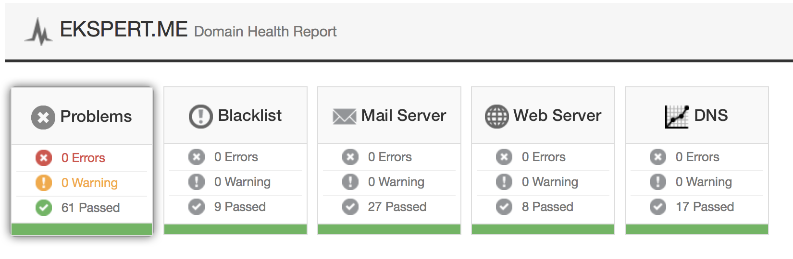
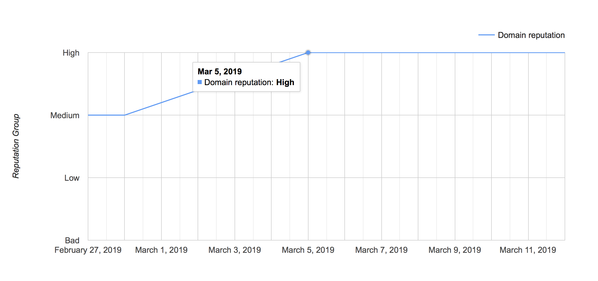
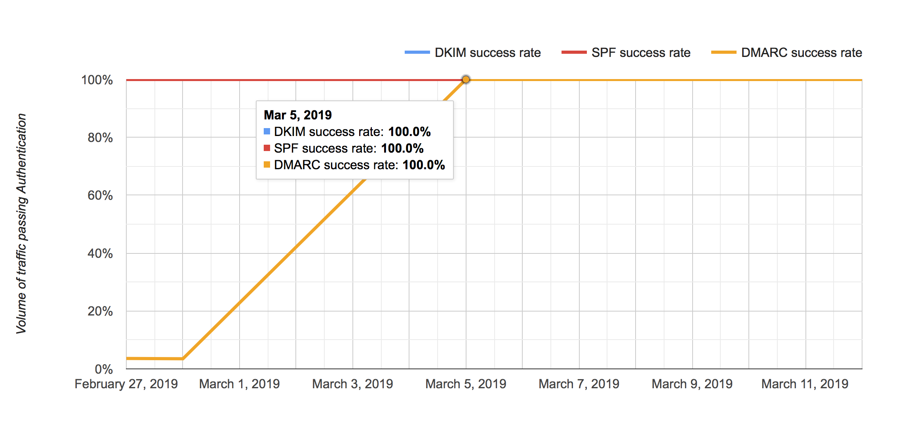

```.header
Title: TuxHat™ Mail Server
Subtitle: Our mail server, carefully tuned for the highest domain reputation
Description: A highly compliant mail service environment, which consists of many software components tuned together to provide rich features of mail transfer and delivery agent, mailbox service, webmail client, spam filter and antivirus protection. 
Image: tuxhat_mail_server.png
Author: Djordje Zekovic @zekome
Date: 21 March 2019
Tags: tuxhat
```

**TuxHat™ Mail Server** is a highly compliant mail service environment, which consists of many software components tuned together to provide rich features of mail transfer and delivery agent, mailbox service, webmail client, spam filter and antivirus protection - designed to keep the highest reputation of your mail domain as receivers keep track of how your domain is used and performs in all messages. The high reputation is an ultimate factor in email deliverability.


**Email is an important and irreplaceable means of communication in business.** You can outsource email to web-based services like Google Apps for Business, or Office365, that’s for sure, but there are some trade-offs. Let’s first see why would you choose to **host your own mail server**?

**Privacy.**  Whenever mail is stored somewhere else, you have at least the possibility that someone else have access to it. That may not be important to you, but if it is, you definitely want your own server and an explict confidentiality contract with your mail system integrator. There are other things as well, providers can scan messages just to show you targeted ads in exchange for their free mail services. There are those who worry about certain cases, where someone can say the word and pull everything without your knowledge. That’s not impossible when you run your own system, but it can be significantly more difficult.

**Control.** You know what happens to your email message after you hit the send button. If you rely on email for business critical communication, you need to know whether your email has been delivered to your customers, or partners, and you need to know who is sending email on your behalf.

Whether an email is received, delayed, not sent or bounces back, you will know right away and you will know why. You have a way of knowing it for sure through inspecting transaction logs on your own server. Then you can set and more easily enforce usage policies, you can automatically add custom disclaimers to every outgoing message, scan emails for trigger words, request delivery status notifications, implement custom mail archive strategy, and so on - you are in control.

**Unrestricted.** You are not limited to a number of emails you can send on per some time basis, limited by storage space per mailbox, number of recipients per email, number and type of attachments, content type, or message size limits. You make your own service packages and impose custom limits only when necessary.

**Deliverability.** You will not be held back by restrictions imposed by any third parties that share the same system. The actions of other party clients could affect your own deliverability, because when sharing servers, your email deliverability is also compromised if they do anything spammy. It’s the major problem that comes with the cheap shared web hosting, where you also get the shared mail service. And even the big ones, like Google, get blacklisted more often due to their shared service nature and enormously large users base that needs to be controlled.

**Cost effective.** Most providers charge you per mailbox, or for a group of users. The charge is pretty small nowadays, especially for few accounts, but it is an offsetting cost as your accounts base grows. With your own Linux-based mail server, it’s likely you can have as many accounts as you want, whenever you want - just forget about pricing based on number of mailboxes.

**Special emails.** With your own mail server, you can have email addresses that do special things reliably, like: private and public distribution lists, domain archive accounts, email extensions, Internet fax, push notification, or whatever email-based service you can imagine. You design the rules, which become the part of mail transaction flow.


## Our services

You’ll get a **mailbox migration** services as part of the TuxHat mail server implementation. We will migrate your current users base and their emails to the new system. There is absolutely no reason to fight back this challenge of new mail server implementation. The migration process usually runs smoothly without any issues. We’ll show the patience, perseverance, and of course precision to migrate necessary data.

You can either provide your own server hardware on your premises, or we can provide you with a dedicated servers hosted by the leading cloud providers. Both ways have their advantages and typical use cases. A **dedicated hosting plan** for your mail system might introduce some additional benefits such as:  higher network bandwidth, better infrastructure availabilty, multipath failover IPs to operate without any interruption, fast backup transfers to the cloud storage, anti-DDoS protection, IPv6 mail routing, etc. 

But, just a running mail server alone is not enough. You can have exceptional features in the box, but without a proper  postmaster’s care it’s likely not going to work well on the long run. You need to keep **the highest reputation** of your domain all the  time. It's recommended to periodically check for spam rate, sender score, authentication pass rate, implementation quality, delivery errors, and so on.


You need to be very careful to keep the mail server playing nice with others - as many people rely on their mail servers even more than their web sites. In computers and technology, a postmaster is the administrator of a mail server and he is supposed to take care of mail service health.

> Our mail server has been running flawlessly for years. All issues have been solved quickly and we've been very satisifed with the provided postmaster services. Kudos to Zeko.Me. - Sreten Scepanovic, Founder, Ekspert.me

We provide the **postmaster services**, which usually includes:  tracking mail system usage, monitoring connections, analyzing delivery reports, checking logs, managing mail queue and disk space, backing up and restoring email files, tuning the overall system,  defining mail exchange strategy, and dealing with spam - all just to keep the highest domain reputation. Nearly every domain should have the e-mail address *postmaster@example.com* and *abuse@example.com* where errors in email processing and complaints are directed. Someone needs to take care of it, and we can manage it for you.

Now, let’s jump to the final level. We take the **compliance** of our mail server solution seriously. It’s a highly compliant system in respect to the leading industry standards. We keep up with the all-green indicators - in all MxToolbox’s tests results,  as they provide accurate network diagnostic and lookup tools for mail domains.

On the following images you can see MxToolbox test results - domain health report - all green, Google Postmaster Tools - Domain reputation jumps to High after DMARC upgrade, and 100% passing authentication for DKIM, SPF, and DMARC - all for domain ekspert(dot)me.







It’s about *a live system*. There are **three things** that you should always consider together when implementing mail system: a mail server solution with advanced features, skilled postmasters to take care of the maintenance, and always satisfied conformity of the implementation with the leading standards, specification, and recommendations. 

So, we offer to you **the full package** - all three things.

Beyond that, we provide development services to high-demanding customers and specific deployment services for policy servers, required mail transaction flows, dedicated mail gateways, clustered mail exchanges, and smarthosts. 


## What’s in the box?

Maybe we can help you to get rid of dozens of chained and mixed mail solutions dispersed over your server room. We have a full package in the same box. It’s all based on OpenSource software, which means that you don’t have to pay any fees for using software components, and it doesn’t impose hidden fees to any third parties either. However, there is still a fee for **our three things** (implementation, postmaster services, and technical support).

**It’s a fair deal of features:**

- SMTP, SUBMISSION, RELAY, IMAP, POP3 endpoints (for receiving, sending, relaying and reading mail messages)
- TLS/SSL encrypted endpoints (opportunistic or forced)
- DMARC, SPF, DKIM implementation
- Multiple domains, user identities, and address aliasing
- Mailbox quota
- AntiSpam protection per user/domain (custom rules, spam learning and whitelisting) with automatic rules update
- AntiVirus scanner with automatic updates of virus definitions
- Outbound messages spam/virus blocker 
- Multiple verification mechanisms of senders
- Remote blacklists and custom scoring
- Mail throttling per user/domain (messages/recipients count and message size limits on per time basis)
- Private and public distribution lists
- Webmail client with multilingual support
- Server side / per user: filtering rules, redirection, responders, and automatic disclaimers
- Headers inspecting and transformation
- Senders and recipients access lists
- Archive-all accounts
- Mailbox backups
- Overall service usage reports
- Centralized management of accounts and class-of-services.

