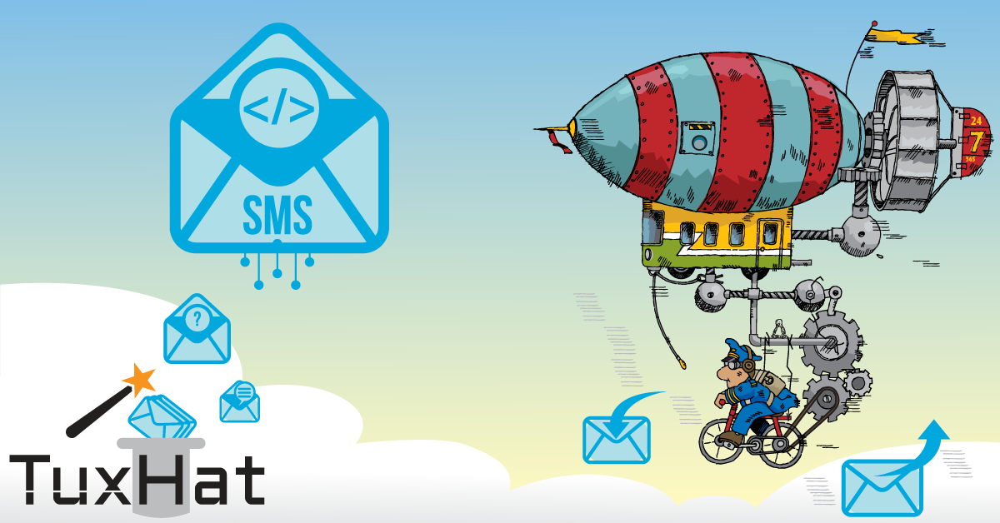
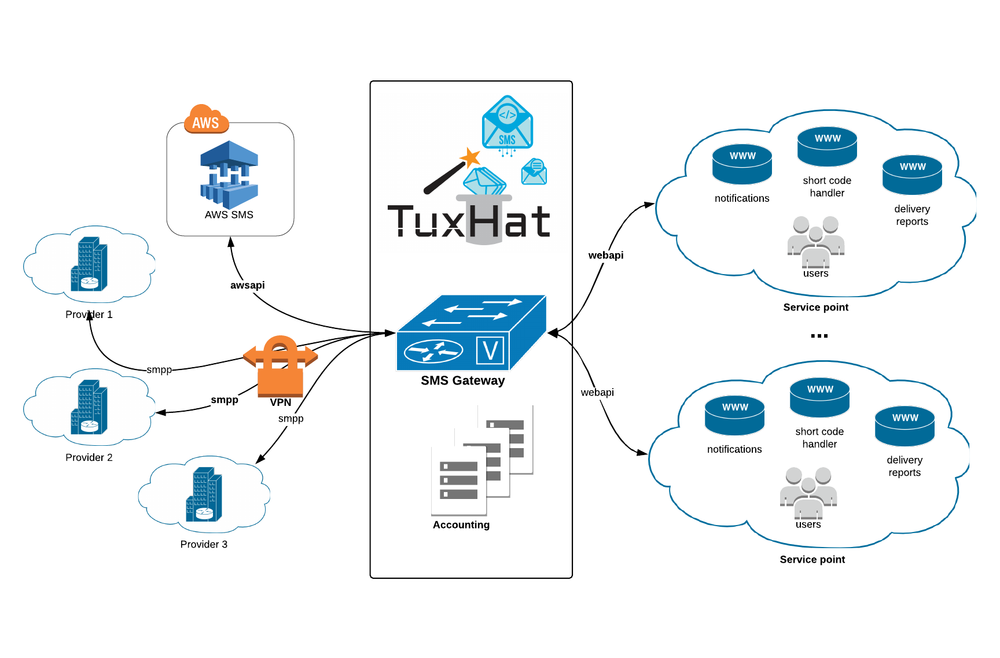

```.header
Title: TuxHat™ SMS Gateway
Subtitle: Usmjeravajte vremenski-kritične SMS tekstualne poruke na pouzdan način.
Description: Ovo je namjenski sistem za usmjeravanje SMS poruka na troškovno optimizovan način, omogućava raznovrsne servise putem poruke, kao i proizvoljne polise korišćenja servisa.
Image: tuxhat_sms_gateway_cover.png
Author: Djordje Zekovic @zekome
Date: 02 February 2019
Tags: tuxhat
Lang: sr, sh, hr, bs
RefLang: /tuxhat-sms-gateway/index.md
```

# TuxHat™ SMS Gateway
*Usmjeravajte vremenski-kritične SMS tekstualne poruke na pouzdan način.*

**TuxHat™ SMS Gateway** je namjenski sistem za usmjeravanje SMS poruka preko lokalnih servisnih operatora i eksternih klaud provajdera na troškovno optimizovan način, omogućava raznovrsne servise putem poruke, kao i proizvoljne polise korišćenja servisa za razna korisnička okruženja.



Da li ste znali, da se *SMS poruka* smatra za vrlo personalni način pridobijanja pažnje? U prosjeku se, u 90% slučajeva, prosječna SMS poruka otvori unutar 10 minuta. To je jedan od razloga zašto su SMS notifikacije široko prihvaćene i korišćene od strane kompanija kako bi došle do svojih korisnika, kao što je to na primjer slanje upozorenja, marketing, ankete, glasanje, bankarstvo, plaćanja i sl.

Dalje, samo mali procenat populacije ima pametne telefone  naspram populacije koja ima bilo koji drugi telefon, odnosno, populacije koja samo može da razmjenjuje tradicionalne tekstualne poruke. Prema tome, sa SMS porukama doseg do korisnika je veći. 

A šta je sa Internet konekcijom? SMS ne podrazumjeva da morate imati Internet vezu i funkcioniše gotovo kod svih koji imaju mobilni telefon. Nije potrebno da se skida bilo šta sa telefona i vjerovatno će kao podrazumjevan način  komunikacije ostati još dugo, sve dok postoje sami telefonski brojevi.

A sada, da prođemo kroz neke uobičajene scenarije korišćenja, kako bi mogli sagledati značaj SMS-a u pružanju korisničkih servisa.

### Scenario 1. Dvofaktorna autentifikacija

Uspon dvofaktornih autenfikacija je učinio da život bude teži za hakere, jer provaljivanje samo lozinke nije više dovoljno kako bi neko pridobio pristup nekom sistemu. Sa dvofaktornom autentifikacijom u upotrebi, potrebno je da imate i drugi dio koda za otključavanje sistema, koji se obično šalje korisnicima na mobilni telefon. To bi značilo da hakeri moraju imati pristup tom mobilnom uređaju takođe, što znatno otežava njihove aktivnosti.

Dvofaktorna autentifikacija je uzela maha u par zadnjih godina, ne samo u korporativnim okruženjma već i u svakodnevnim korisničkim aplikacijama. Slanje drugog koda preko SMS-a je postao uobičajeni implementacioni metod.

Ovaj način sigurnosti se zasniva na potrebi da krajnji korisnik posjeduje neki fizički uređaj koji može da prima SMS poruke (mobilni telefon). Ovakav tip sistema se svakodnevno koristi kroz razne Fejsbuk, Tviter i Amazon verifikacione procese.


### Scenario 2. SMS plaćanja

SMS sistem može biti jednostavno sredstvo plaćanja raznih dobara, usluga ili proizvoda preko tekstualnih poruka poslatih sa mobilnog telefona.

SMS plaćanja funkcionišu poput slanja standardnih SMS poruka. Preko SMS sistema za plaćanje, kupci šalju poruku da plate za određeni artikal ili naznačenu uslugu. Ovakva  tekstualna poruka se šalje do servisnih provajdera za tu vrstu plaćanja, gdje se finalno odobrava transakcija između kupca i prodavca.

Trošak plaćanja se stavlja na mjesečni telefonski račun ili se oduzima od pripejd kredita od strane mobilnog operatora. Korišćenjem SMS plaćanja, korisnici mobilne telefonije mogu bezbjedno, brzo i zaštićeno da plaćaju prodavcima, kupuju robu ili koriste usluge, realne ili virtuelne, kao i da prave depozite ili da šalju novac.

Preko SMS plaćanja može se kuputi Coca Cola u Evropi, poštanske markice ili knjige u Danskoj, plaćati parking u Crnoj Gori, kupiti burgeri u Finskoj, ili plaćati putne karte u Tokiju, Parizu i Rimu.

### Scenario 3. SMS bankarstvo

SMS bankarstvo je forma mobilnog bankarstva korišćena od strane banka i drugih finansijskih institucija radi slanja notifikacija i upozorenja svojim korisnicima, ili radi pružanja servisa, koji opet na neki način, omogućavaju korisnicima da izvršavaju razne finasijske transakcije putem SMS-a.

Tipični servisi uključuju periodično slanje izvještaja sa računa; izvještaja o uplati plate i drugih dospijeća sa bankarskog računa; izvještaja o uspješnosti izvršenja naloga; upozorenje o nedovoljno sredstava na računu; većih povlačenja sredstava sa bankomata ili drugih neuobičajenih aktivnosti na kreditnoj kartici; upozorenja da je dospjelo neko plaćanje, ili da je elektronski izvod spreman za skidanje.

Takođe, SMS poruke mogu da se koriste u oba pravca. Tipični korisnički zahtjevi preko SMS-a uključuju upite u stanje računa; zahtjeve za mini izvode; slanje zahtjeva za elektronsko plaćanje računa; obavljanje transfera između korisničkih računa, kao na primjer prebacivanje novca sa štednog na tekući račun; stopiranje isplata za čekove; slanje zahtjeva za suspenziju kreditne kartice u slučaju da je izgubljena ili ukoliko je došlo do kompromitacije PIN koda; upit u kursne liste raznih valuta; upit u kamatne stope za depozite i sl.

## Tehničko gledište

Na sigurnosni način uspostavljamo veze prema lokalnim mobilnim operatorima (SMPP preko IPSEC-a), povezujemo bilo koje druge eksterne servisne provajdere preko njihovih specifičnih API poziva (na primjer Amazon Web Servisi) i uspostavljamo pouzdane komunikacione kanale - sve gledano iz perspektive SMS gateway-a. Potrebni integracioni radovi su uvijek dio naših implementacionih usluga - nijedna implementacija nije ista.



Sa druge strane, svi interni klijenti, koji su locirani u okviru iste ili između različitih servisnih tačaka na strani korisnika, se autentifikuju prema SMS gateway-u i dobijaju dozvolu korišćenja servisa u skladu sa podešenom polisom (dozvoljeni brojevi telefona, kontrole saobraćaja, dozvoljeno doba dana za slanje, maksimalni broj poruka mjesečno i sl.). Informacije o korišćenju servisa se čuvaju na disku u detaljnim zapisima, koji mogu da se direktno šalju prema trećoj strani radi proizvoljnog obračuna i naplate.

Uspostavljamo diversifikovane klase servisa između više konkurentnih klijenata u skladu sa potrebama, na osnovu čega usmjeravamo SMS saobraćaj u oba pravca. Pokrivamo par interesantnih osobina servisa kao što je to: proizvoljni obrađivači po kratkom kodu, usmjeravanje na različite grupe servera na osnovu sadržaja iz poruke, proizvoljne DLR putanje za prijem izvještaja o isporuci; DLR okidači, balansiranje saobraćaja između raznih uzvodnih konekcija, prelaz na sekundarnog operatora u slučaju ispada, postavljanje ograničenja saobraćaja ili porta, skladištenje poruka u vremenskim nizovima na disku, odloženo ponovno slanje poruka u intervalima, proizvoljna obračunska logika za naplatu.

U zavisnosti od vaših poslovnih potreba i opterećenja korišćenja, SMS gateway sistem se može implementirati u raznim skalabilnim scenarijima. Možete početi sa vrlo malo resursa - kao na primjer da sve pokrećete samo sa jedne virtuelne mašine, ili da idete više ka enterprajz varijanti, gdje imate više paralelnih radnih instanci. Budite sam svoj SMS servisni provajder.


 


 

