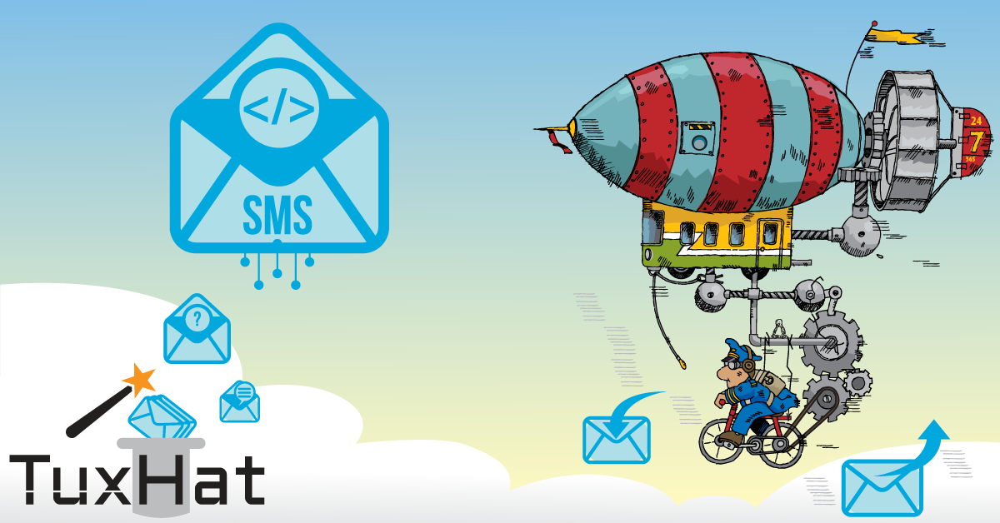
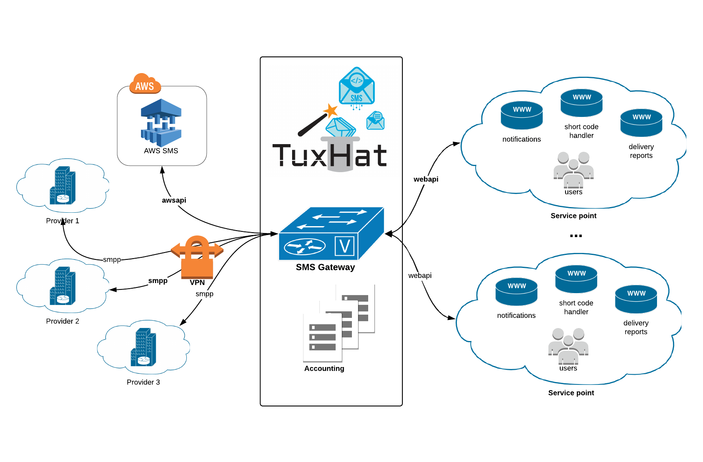

```.header
Title: TuxHat™ SMS Gateway
Subtitle: Get the time-critical SMS messages routed reliably.
Description: A dedicated system for routing SMS messages, optimizing operating costs, enabling diversified messaging services, and providing custom service usage policy. 
Image: tuxhat_sms_gateway_cover.png
Author: Djordje Zekovic @zekome
Date: 12 February 2019
Tags: tuxhat
```

# TuxHat™ SMS Gateway
*Get the time-critical SMS messages routed reliably.*

**TuxHat™ SMS Gateway** is a dedicated system for routing SMS messages through local service carriers and external cloud providers by optimizing the operating costs, enabling diversified messaging services, and providing custom service usage policy for different kind of user environments. 



Did you know, that *SMS message*, is considered by users as one of the most personal way to raise attention? On average, a SMS message is opened at 90% within 10 minutes. Perhaps, that’s why SMS notification is so widely accepted and used by companies to reach customers for a variety of purposes such as sending alerts, marketing, surveys, voting, banking, payments, etc. 

Furthermore, only a small percentage of the population have smart phones, versus the amount of population that have any other mobile phones, and therefore, that support the sending of traditional text messages only. Therefore, with SMS you can reach more people.

What about Internet connectivity? SMS does not require an Internet connection and works with most everyone with a mobile phone. You don't have to download anything to use it and it’s likely to stay around as long as telephone numbers exist.

Let’s go throw some common use cases and see the importance of SMS in service providing.

### Use case 1. Two-factor authentication.

The rise of two-factor authentication has made life much harder for hackers, as stealing a password alone is no longer enough to gain access to a system. With two-factor authentication in place, you need a second code to unlock the system, one that's usually sent to the user's phone. Hackers therefore need to lay their hands on that device too, making their task much more challenging.

Two-factor authentication has become widespread in recent years, not only on corporate systems but also for everyday consumer applications. Sending the second code via SMS is the most common implementation method.

Such security relies on the need for possession of a physical device (mobile phone) on the end-user side. This kind of system is used everyday by Facebook, Twitter and Amazon’s verification system.


### Use case 2. SMS Payments

SMS payments are a means of paying for goods, services or products via a text message sent from a mobile phone.

They work like standard SMS. With the SMS payment system purchasers send a text message to pay for an item or service. This text message is sent to mobile payment providers. The provider clears the transaction between the purchaser and the vendor.

The cost of the purchase is added to the monthly phone bill or deducted from a pre-paid balance by the mobile phone operator. By using SMS payments, mobile phone users can securely, quickly and safely pay merchants, buy goods or services, real or virtual, as well as make deposits or send remittances.

Using SMS payments people can buy Coca Cola in Europe, postage stamps or books in Denmark, pay parking in Montenegro, get burgers in Finland, and travel tickets in Tokyo, Paris and Rome.

### Use case 3. SMS Banking

SMS banking is a form of mobile banking used by some banks or other financial institutions to send notifications or alerts to customers' mobile phones using SMS messaging, or a service provided by them which enables customers to perform some financial transactions using SMS.

Typical services includes periodic account balance reporting; reporting of salary and other credits to the bank account; successful or un-successful execution of a standing order; insufficient funds; large value withdrawals on an account, ATM, or out of country activity on a credit card; an alert that some payment is due
or that an e-statement is ready to be downloaded.

SMS messaging can be used in both ways. Typical pull services includes account balance enquiry; mini statement request; electronic bill payment; transfers between customer's own accounts, like moving money from a savings account to a current account; stop payment instruction on a cheque; requesting for an ATM card or credit card to be suspended; De-activating a credit or debit card when it is lost or the PIN is known to be compromised; foreign currency exchange rates enquiry; fixed deposit interest rates enquiry.

## Technical point of view

We securelly make connections to the local mobile carriers (SMPP over IPSEC), connect any other external service providers using their specific cloud API (ex. Amazon Web Services), and establish reliable communication channels - all from the SMS gateway perspective. Required integration works is always part of our implementation services - no two implementations are the same.



On the other side, all internal clients, residing within  the same or between different customer’s service points, are authenticated to SMS gateway and granted specific level of service according to configured usage policy (allowed destination numbers, traffic control, time-of-day, max number of messages per month, etc.). The service usage is beeing kept in detailed accounting records, which can be pushed further to the 3rd-party systems for custom billing processing.

We establish diversified class of services among many concurrent clients according to their service needs and accordingly route SMS traffic both ways. We cover some interesting features such as: custom handlers per short code, routing by message content between different server groups, customized DLR paths for receiving delivery notifications, DLR triggers, balancing traffic among different uplink connections, carrier failover, traffic/port limits, hard-storage queueing, back-off algorithm for resending of messages, and custom billing pre/post logic.
 
Depending on your business needs and load requirements, the SMS gateway system can be implemented in different scalable deployments. You can start small - like running everything from a single virtual machine, or go more enterpise and deploy multiple processing nodes. Be your own SMS service provider.


 


 
